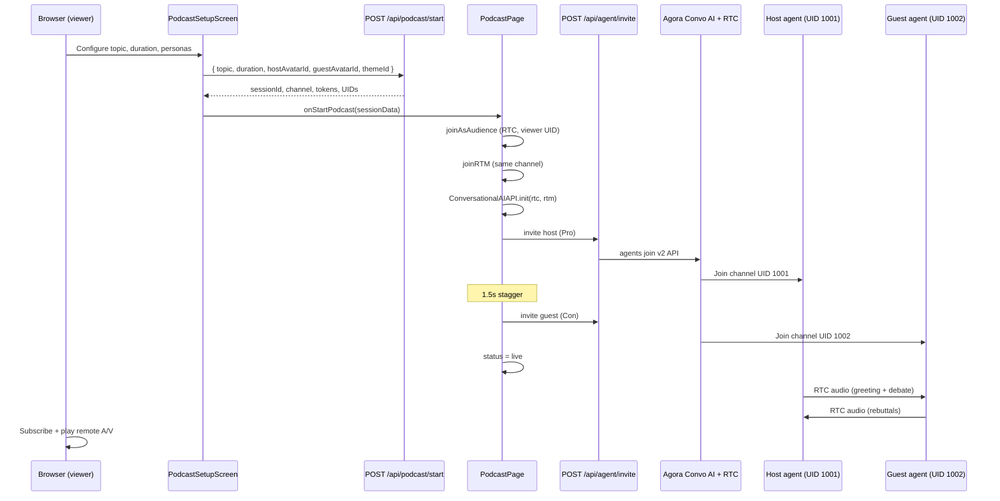
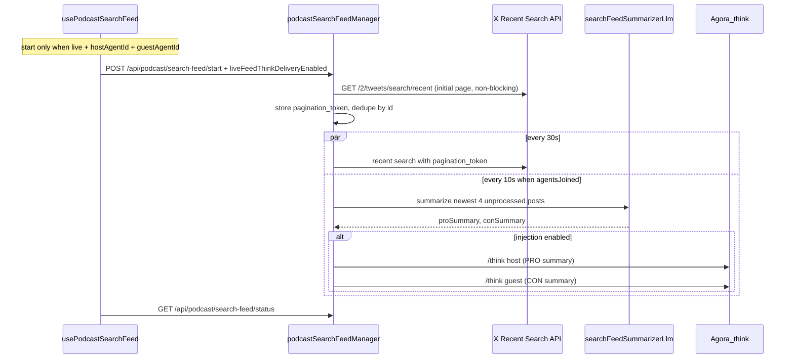
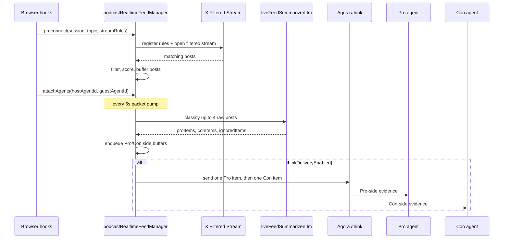

# AI Debate — Architecture & Flow

Complete technical reference for the **two-agent AI debate** feature: how Pro and Con debaters join one Agora channel, talk to each other over RTC audio, and how the human viewer fits in via RTC + RTM.

For a short presenter script, see [debate-demo.md](../debate-demo.md).

---

## Table of contents

1. [What this feature is](#what-this-feature-is)
2. [Routes and screens](#routes-and-screens)
3. [Session state machine](#session-state-machine)
4. [RTC UID map](#rtc-uid-map)
5. [End-to-end startup flow](#end-to-end-startup-flow)
6. [How the two agents talk to each other](#how-the-two-agents-talk-to-each-other)
7. [Viewer connection: RTC + RTM](#viewer-connection-rtc--rtm)
8. [Audience chat and agent instructions](#audience-chat-and-agent-instructions)
9. [Live X feed enrichment](#live-x-feed-enrichment)
10. [Live transcript and agent state](#live-transcript-and-agent-state)
11. [Anam avatars (on vs off)](#anam-avatars-on-vs-off)
12. [API keys and secrets](#api-keys-and-secrets)
13. [Wrap-up and teardown](#wrap-up-and-teardown)
14. [API routes reference](#api-routes-reference)
15. [Source file map](#source-file-map)
16. [Environment variables](#environment-variables)

---

## What this feature is

The app runs **two Agora Conversational AI agents** in a single RTC channel:

| Role | UI label | Code role | Position |
|------|----------|-----------|----------|
| Affirmative debater | **Pro** | `host` | Argues *for* the motion |
| Negative debater | **Con** | `guest` | Argues *against* the motion |

The human is a **viewer** (not a third debater): they listen/watch, read the transcript, and can send **audience messages** that are injected into the host agent via Agora’s Think API.

**Important:** Agents do **not** chat with each other through your app’s RTM or REST relay. Turn-taking is **voice-based**: each agent’s ASR listens to the other agent’s **RTC audio**, and VAD (voice activity detection) decides when to respond.

---

## Routes and screens

| URL | Component | Purpose |
|-----|-----------|---------|
| `/` | `PodcastLandingPage` | Marketing / entry — “Start a Debate” |
| `/create` | `PodcastPage` | Setup → loading → live studio → ended |
| `/podcast/create` | Redirect | Redirects to `/create` |

`PodcastPage` is the **orchestrator**: it switches UI by `usePodcastStore().status` and wires hooks (`usePodcastRTC`, `usePodcastRTM`, `usePodcastTranscript`).

Internal API paths use the `podcast` prefix (`/api/podcast/*`) for historical reasons; the product surface is branded as **AI Debate**.

---

## Session state machine

Zustand store: `src/store/usePodcastStore.ts`

```
idle → setting-up → loading → live → wrapping-up → ended
```

| Status | UI |
|--------|-----|
| `idle` / `setting-up` | `PodcastSetupScreen` — topic, duration, avatars toggle, personas, theme |
| `loading` | Spinner while RTC/RTM join + agents invite |
| `live` | `PodcastStudioScreen` — stage, transcript, audience chat, controls |
| `wrapping-up` | Closing statements; audience relay to host is disabled |
| `ended` | `PodcastEndedScreen` — full transcript, copy export |

---

## RTC UID map

Assigned in `app/api/podcast/start/route.ts` when a session is created:

| UID | Participant | RTC role | Publishes |
|-----|-------------|----------|-----------|
| `5000 + random` | **Viewer (browser)** | Subscriber (audience) | Nothing |
| `1001` | **Pro / Host agent** | Publisher | TTS audio (and video if avatars **off**) |
| `1002` | **Con / Guest agent** | Publisher | TTS audio (and video if avatars **off**) |
| `999998` | **Host Anam avatar** | Publisher | Video (+ audio when avatars **on**) |
| `999999` | **Guest Anam avatar** | Publisher | Video (+ audio when avatars **on**) |

Channel name: `podcast-{sessionId}` where `sessionId` is an 8-character UUID slice.

Tokens:

- **Viewer** receives one `buildTokenWithRtm` token (RTC subscriber + RTM).
- **Host/guest agent tokens** are generated server-side but passed to Agora via `/api/agent/invite` (not directly to the browser for those UIDs).

---

## End-to-end startup flow



### Step-by-step (code paths)

1. **`PodcastSetupScreen`** — User submits → `POST /api/podcast/start` → stores config in Zustand → calls `onStartPodcast(sessionData)`.
2. **`PodcastPage.handleStartPodcast`**
   - `usePodcastRTC.joinAsAudience(rtcToken, uid, channel)` — viewer subscribes to remote tracks.
   - `usePodcastRTM.joinRTM(rtmToken, uid, channel)` — RTM for audience chat + transcript helper.
   - `ConversationalAIAPI.init({ rtcEngine, rtmEngine })`.
   - `inviteAgent(channel, viewerUid, hostSettings)` then ~1.5s later `inviteAgent(..., guestSettings)`.
3. **`/api/agent/invite`** — Builds Agora join payload (LLM, TTS, ASR, turn detection, optional Anam avatar), calls Agora REST API.
4. **Studio** — `PodcastStudioScreen` renders when `status === "live"`.

---

## How the two agents talk to each other

### Pipeline per agent

```
Other agent's RTC audio
  → ASR (Ares)
  → Turn detection (VAD, adaptive interrupt)
  → LLM (gpt-4o-mini, role-specific system prompt)
  → TTS (ElevenLabs, per-persona voice_id)
  → Publish audio on RTC (agent UID or avatar UID)
```

### `remote_rtc_uids` — who each agent listens to

Configured in `PodcastPage.buildAgentSettings`:

| Avatars | Host (Pro) listens to | Guest (Con) listens to |
|---------|----------------------|------------------------|
| **On** | `999999` (guest avatar) | `999998` (host avatar) |
| **Off** | `1002` (guest agent) | `1001` (host agent) |

When Anam is enabled, lip-sync audio is published on the **avatar UID**, not the agent RTC UID — so `remote_rtc_uids` must point at avatar UIDs.

Passed through `agentSettings.remote_rtc_uids` and honored in `app/api/agent/invite/route.ts` (not overwritten by default `*`).

### Greetings and turn-taking

| Agent | `greeting_message` | Behavior |
|-------|-------------------|----------|
| **Host (Pro)** | Built by `buildHostGreeting()` | Opens the debate on join (`greeting_configs: { mode: "single_first" }`) |
| **Guest (Con)** | `"__NONE__"` | Joins silently; responds when host audio triggers VAD |

Turn detection (podcast-specific tuning in `PodcastPage.tsx`):

- `interrupt_mode: "adaptive"`
- `threshold: 0.7`
- `silence_duration_ms: 1500`
- `interrupt_duration_ms: 800`

**No app-level text relay** between agents — see comment in `PodcastPage.tsx`:

```ts
// Voice-based turn detection: agents hear each other directly via audio.
// No text relay needed — VAD handles turn-taking naturally.
```

### System prompts

`src/config/podcast/prompts.ts`:

- `buildHostSystemPrompt` — Pro / affirmative
- `buildGuestSystemPrompt` — Con / negative

Personas and ElevenLabs `voice_id` per character: `src/config/podcast/avatars.ts` (`HOST_AVATARS`, `GUEST_AVATARS`).

---

## Viewer connection: RTC + RTM

The viewer is **not** RTM-only. On start, the browser joins **both** transports on the **same channel name**:

| Transport | Hook | Purpose |
|-----------|------|---------|
| **RTC** | `usePodcastRTC` | Subscribe to remote **audio** (debate) and **video** (Anam faces on UIDs 999998/999999) |
| **RTM** | `usePodcastRTM` | Audience chat publish/subscribe; feeds `ConversationalAIAPI` for transcript |

RTC join details (`usePodcastRTC.ts`):

- Mode: `live`, role: `audience` with low latency
- Handlers: `user-published` / proactive poll every 2s (agents may publish late)
- Maps tracks to host/guest by UID

Agents use:

```ts
advanced_features: { enable_rtm: true }
parameters: { data_channel: "rtm" }
```

So transcript and agent-state events flow over **RTM**, while debate audio is on **RTC**.

---

## Audience chat and agent instructions

### RTM audience chat

`usePodcastRTM.sendAudienceMessage`:

1. Publishes JSON to the RTM channel with `customType: "AUDIENCE_CHAT"`.
2. Adds message to local Zustand store immediately.
3. Other viewers receive via RTM `message` listener (skips own publisher).

Rate limit: **10 seconds** between sends per client.

### Injecting into agents (not RTM peer-to-peer)

Audience text does **not** go to agents over RTM. It uses Agora’s **Think API**:

`sendAgentInstruction(agentId, { text, on_speaking_action: "interrupt" })` → `POST /api/agent/think`

Logic (`usePodcastRTM.ts`):

- If guest is **speaking**, send interrupt instruction to guest, then inject prefixed message to **host**.
- Otherwise inject `[Audience Message from {name}] {text}` to **host**.
- Skipped when `status === "wrapping-up"`.

`sendQuestionToAgent` — same Think path, always to host with `[Audience Question]` prefix.

---

## Live X feed enrichment

Setup offers three **Live Feed** modes (`PodcastXFeedMode` on `PodcastConfig.xFeedMode`):

| Mode | Default | Runtime | Agent delivery |
|------|---------|---------|----------------|
| `off` | | No live X polling | — |
| `search_posts` | **Yes** | X Recent Search polling | `/think` when `liveFeedThinkDeliveryEnabled` (default **off**) |
| `filtered_stream` | | X Filtered Stream | `/think` when `liveFeedThinkDeliveryEnabled` (default **off**) |

Legacy configs may still set `realtimeTopicFeedEnabled: true`; `resolvePodcastXFeedMode()` maps that to `filtered_stream`.

This is separate from setup-time X context: setup uses the signed-in viewer's timeline to pick a motion; live feeds use an app bearer token plus either a **search query** or **filtered-stream rules**.

### Search Tweets (recent search polling + optional /think)

Poll X recent search and summarize into Pro/Con pending buffers every **10s**. **By default** summaries stay in studio buffers only (`liveFeedThinkDeliveryEnabled: false`). When the setup toggle **Inject live X to agents (/think)** is on, the feed delivers one summary per side to the correct agent via Agora `/think` on the same 10s timer (stops when debate ends). `PodcastLiveFeedThinkControls` (inject/interrupt/ignore + interruptable) appear only when injection is enabled; settings are shared with Filtered Stream.



- **Agent gate:** client starts feed only when `status` is `live` or `wrapping-up` and both `hostAgentId` and `guestAgentId` are set; server sets `agentsJoined` and runs the classify+deliver timer only then.
- **Injection toggle:** `PodcastConfig.liveFeedThinkDeliveryEnabled` (default `false`); plumbed to server as `thinkDeliveryEnabled` on session stats.
- **Think actions:** `PodcastConfig.liveFeedThinkActions` from setup, only when injection is on; defaults `inject` / `ignore` / `ignore`, `interruptable: false`.
- **Delivery routing:** Pro summary → host only; Con summary → guest only; text uses `[LIVE X CONTEXT]` via `buildThinkTextFromItem` (no redundant `Motion:` line — motion is already in agent system prompt).
- **Query:** editable `searchQuery` string only (no URL params like `max_results`, `tweet.fields`, etc. in the stored query).
- **Polling:** every **30s** with `pagination_token`; dedupe by tweet id; `POST /refresh` triggers one immediate poll.
- **Classification + delivery:** background timer every **10s**; batch of **4** newest `new` posts; when injection is on, dequeue up to 1 Pro + 1 Con pending summary for `/think`; retries up to 3 per item.
- **Stop:** `stop()` / `clearTimers()` clears poll + classify (delivery piggybacks on classify timer); no further `/think` after debate end.
- **API params (server):** `max_results=10`, `sort_order=recency`, standard tweet/user field expansions.
- **UI:** Recent Posts + Pro/Con pending buffers + delivery history; Think API panel merges `deliveryHistory`; manual refresh on Recent header.

Key files:

- `src/lib/podcastSearchFeed.ts` — session manager, polling, dedupe, classify+deliver timer, `/think`.
- `src/lib/searchFeedSummarizerLlm.ts` — Pro/Con summarizer (delivery in feed manager).
- `src/hooks/podcast/usePodcastSearchFeed.ts` — start/status/stop/refresh lifecycle.
- `src/components/podcast/SearchTweetsFeedPanel.tsx` — studio + mobile settings panel.
- `app/api/podcast/search-feed/*` — `start`, `status`, `stop`, `refresh`.

### Filtered Stream (persistent stream + optional /think)

When `xFeedMode === "filtered_stream"`, the app uses X Filtered Stream as a live evidence source for the debate. Same opt-in injection toggle as Search Tweets: `liveFeedThinkDeliveryEnabled` defaults **off**; classify/buffer always runs; `/think` delivery only when enabled.

### Runtime flow



### No opening gate

The live feed intentionally **preconnects early** so the X stream is warm and posts are not missed while agents join. In the current implementation, `/think` enrichment does **not** wait for both opening turns to be observed.

The manager records opening turns for diagnostics/status when `POST /api/podcast/live-feed/opening-turn` arrives, but `flushEvidencePacket()` is not gated by `isOpeningExchangeComplete()`. Once agents are attached and there is queued work, the packet pump can classify and deliver live evidence.

### Buffer and delivery behavior

Packets run every **5 seconds** (`PACKET_INTERVAL_MS = 5_000`). On each tick, `flushEvidencePacket()` does the following:

1. If the raw X buffer has posts, `classifyRawBuffer()` ranks the buffer and sends up to **4 posts** to `liveFeedSummarizerLlm.ts`.
2. The classifier returns `proItems`, `conItems`, and `ignoredItems`. Each tweet should land in exactly one bucket; if the LLM duplicates a post in both Pro and Con, parsing keeps the Pro item and removes the Con duplicate.
3. `applyClassificationToSession()` pushes Pro items into `proFilteredBuffer` and Con items into `conFilteredBuffer`.
4. If `thinkDeliveryEnabled`, `deliverOneSideItem(session, "PRO")` sends at most one queued Pro item to the host/Pro agent via `/think`.
5. If `thinkDeliveryEnabled`, `deliverOneSideItem(session, "CON")` sends at most one queued Con item to the guest/Con agent via `/think`. When injection is off, steps 1–3 still run; delivery is skipped.

Normal packets use the configured safe `/think` actions: `on_listening_action: "inject"`, `on_thinking_action: "ignore"`, `on_speaking_action: "ignore"`, and `interruptable: false`. High-engagement breaking posts escalate to interrupt actions for listening, thinking, and speaking.

### Filtered Stream idle timeout and retry behavior

The Live X feed uses a persistent X API v2 Filtered Stream connection:

```text
GET /2/tweets/search/stream
```

The stream is expected to deliver either:

1. Matching post payloads.
2. Empty keep-alive / heartbeat lines when no posts match.

In `src/lib/podcastRealtimeFeed.ts`, every stream read is guarded by `STREAM_READ_IDLE_MS = 30_000`. If the client receives no bytes for 30 seconds, meaning no post payload and no blank heartbeat line, `readStreamChunk()` throws:

```text
X stream read idle timeout (30s, no heartbeat)
```

This timeout does not mean the classifier ignored all posts. Ignored posts are normal: `liveFeedSummarizerLlm.ts` can classify streamed posts as `ignoredItems`, and `applyClassificationToSession()` removes those selected posts from the raw buffer. The stream should continue listening after ignored posts.

When an idle timeout or other retryable stream error happens, the manager:

1. Cancels the current `ReadableStream` reader.
2. Marks the session as disconnected.
3. Records `lastDisconnectAt`.
4. Waits before reconnecting.
5. Opens a new Filtered Stream connection.
6. Reuses already registered rules when possible.

Reconnect handling includes:

- `idle` timeout reconnects.
- Network errors with linear backoff.
- HTTP/operational disconnects with exponential backoff.
- `429` rate limits with longer exponential backoff.
- Connection-limit / too-many-connections errors with exponential backoff.
- Fatal stop for auth or account-limit cases such as `401`, `403`, spend cap, or usage cap.

The manager also prevents accidental duplicate stream connections with a process-level `connectionLock` and enforces a minimum reconnect gap after disconnect. This helps avoid X returning a connection-limit error while the previous persistent connection is still being released server-side.

Current open question: X docs say Filtered Stream sends keep-alive blank lines roughly every 20 seconds. If the client receives neither matching posts nor keep-alive bytes for 30 seconds, we currently treat the stream as stale and reconnect. We still need to confirm whether 30 seconds is the right watchdog threshold, or whether a larger value such as 45-60 seconds is safer in production.

`backfill_minutes` is not a fix for missing heartbeat. It can only help recover matching posts after a reconnect, and may produce duplicates, so `seenPostIds` dedupe remains required.

Key files:

- `src/hooks/podcast/usePodcastRealtimeFeed.ts` — starts preconnect, attaches agents, polls status.
- `src/hooks/podcast/usePodcastTranscript.ts` — reports final opening turns.
- `src/lib/podcastRealtimeFeed.ts` — stream lifecycle, buffering, summarization, side queues, `/think` delivery.
- `src/lib/liveFeedSummarizerLlm.ts` — validates raw posts and classifies them into Pro, Con, or ignored.
- `src/lib/agoraThink.ts` and `src/lib/debateFeedLog.ts` — sanitized request/response logging for `/think` debugging.

---

## Live transcript and agent state

`usePodcastTranscript.ts`:

1. `ConversationalAIAPI.init({ rtcEngine, rtmEngine })`
2. `api.subscribeMessage(channelId)` on live/wrapping-up
3. `TRANSCRIPT_UPDATED` → map UID `1001` → Pro, `1002` → Con (ignores viewer UID)
4. If **Filtered Stream** is active (`xFeedMode === "filtered_stream"`), first final Pro/Con turns are reported to `POST /api/podcast/live-feed/opening-turn` for diagnostics.
5. `AGENT_STATE_CHANGED` → updates `hostAgent.state` / `guestAgent.state` (IDLE, LISTENING, THINKING, SPEAKING)
6. Persists to IndexedDB via `src/utils/podcast/podcastDB.ts`

UI: `PodcastTranscriptPanel`, `MobileTranscriptChatSheet`, speaking indicators on `StageArea` / `AvatarTile`.

---

## Anam avatars (on vs off)

Controlled by `config.avatarEnabled` (setup toggle; default **off**).

| Toggle | Agent audio UID | Video | Anam API keys |
|--------|---------------|-------|---------------|
| **Off** | `1001` / `1002` | None from agents | Not used |
| **On** | Avatar UIDs `999998` / `999999` | Anam streams | Host key vs guest key (see below) |

Avatar config in `buildAgentSettings` when enabled:

```ts
avatar: {
  enable: true,
  vendor: "anam",
  params: {
    api_key: isHost ? NEXT_PUBLIC_ANAM_PODCAST_KEY_HOST : NEXT_PUBLIC_ANAM_PODCAST_KEY_GUEST,
    agora_uid: hostAvatarUid | guestAvatarUid,
    avatar_id: avatar.anamAvatarId,  // from avatars.ts
  },
}
```

`/api/agent/invite` provisions Anam tokens and binds `agora_uid` for each avatar publisher.

---

## API keys and secrets

| Variable | Used for |
|----------|----------|
| `LLM_API_KEY` | Injected server-side in `/api/agent/invite` (client sends `***MASKED***`) |
| `ELEVENLABS_API_KEY` | TTS for both agents |
| `NEXT_PUBLIC_ANAM_PODCAST_KEY_HOST` | Pro debater Anam session (client-sent in invite body) |
| `NEXT_PUBLIC_ANAM_PODCAST_KEY_GUEST` | Con debater Anam session |
| `ANAM_API_KEY` | **Not** used for dual debate when podcast keys are set; fallback for single-agent / 1:1 flows in `invite` route |
| Agora credentials | Tokens + Conversational AI REST |

**Why two Anam keys?** One streaming avatar per API key avoids Anam concurrency limits when both debaters use faces at once.

---

## Wrap-up and teardown

### Timer-driven wrap-up

`usePodcastTimer` — when remaining time hits zero → `onWrapUp` → `PodcastStudioScreen.handleWrapUp`.

### Wrap-up sequence

1. `POST /api/podcast/wrap-up` — appends `WRAPUP_INJECTION` to host agent system messages via Agora agent **update** API.
2. `sendAgentInstruction(hostAgentId, ...)` — Think API tells Pro to invite Con to close, then close in favor.
3. State machine watches host speaking turns; after 2 host turns post-wrap-up → auto `onStop` (or 45s fallback timer).

### Stop

`PodcastPage.handleStop`:

- `POST /api/podcast/stop` — stops both agent IDs on Agora
- `leaveChannel` (RTC) + `leaveRTM`
- `status = ended`

---

## API routes reference

| Route | Method | Role |
|-------|--------|------|
| `/api/podcast/start` | POST | Create session, channel, UIDs, viewer token |
| `/api/podcast/stop` | POST | Stop host + guest agents |
| `/api/podcast/wrap-up` | POST | Update host LLM system messages for closing |
| `/api/podcast/extend` | POST | Extend session timer (if used) |
| `/api/x/context` | GET | Load signed-in user’s X profile, posts, timeline for setup (`?refresh=1` bypasses cache) |
| `/api/podcast/suggest-setup` | POST | Generate debate motion + `searchQuery` or `streamRules` from one X story (`feedMode`) |
| `/api/podcast/search-feed/start` | POST | Start Search Tweets session (requires `hostAgentId`, `guestAgentId`); initial Recent Search fetch only |
| `/api/podcast/search-feed/status` | GET | Poll recent/pro/con buffers and classifier state |
| `/api/podcast/search-feed/refresh` | POST | Trigger one immediate Recent Search poll |
| `/api/podcast/search-feed/stop` | POST | Stop polling and clear search session |
| `/api/podcast/live-feed/preconnect` | POST | Register X stream rules, open filtered stream, and buffer posts before agents are ready |
| `/api/podcast/live-feed/attach-agents` | POST | Bind Pro/Con agent IDs and start the opening transcript gate |
| `/api/podcast/live-feed/opening-turn` | POST | Mark first final Pro/Con transcript turn; releases queued enrichment after both roles speak |
| `/api/podcast/live-feed/status` | GET | Poll stream/buffer/enrichment status for UI badges |
| `/api/podcast/live-feed/stop` | POST | Stop stream, remove session rules, clear packet timer |
| `/api/agent/invite` | POST | Start each Conversational AI agent |
| `/api/agent/think` | POST | Inject audience text / wrap-up instructions |
| `/api/agent/stop` | POST | Used indirectly via podcast stop |

Server session map: `app/api/podcast/sessions.ts` (in-memory `podcastSessions`).

### X API context (debate setup)

Used on `PodcastSetupScreen` to personalize setup from the viewer’s X account.

1. User signs in with **X OAuth 2.0** (NextAuth Twitter provider). Scopes: `users.read`, `tweet.read`, `offline.access`. OAuth 2.0 **user access token** is stored in the JWT (server-only via `getToken`).
2. Client calls `GET /api/x/context`. Server fetches in parallel:
   - `GET /2/users/me` — profile / bio
   - `GET /2/users/{id}/tweets` — your posts
   - `GET /2/users/{id}/timelines/reverse_chronological` — home timeline
3. Response is grouped into buckets (your posts, timeline, bio & themes). UI is mobile-first: collapsible bucket cards, 44px touch targets, safe-area padding.
4. User selects **one** story (radio; usually from **Trending** / personalized trends). Optional: tap fills debate topic draft from headline.
5. **Generate debate setup** produces one **debate motion** plus either a **search query** (Search Tweets, default) or up to **three filtered-stream rules** (Filtered Stream). Both are editable before start.

**Not used for this flow:** App-only Bearer Token (public lookup only). See [Post Lookup](https://docs.x.com/x-api/posts/lookup/introduction) vs timeline endpoints in [X API](https://docs.x.com/x-api/introduction).

After changing OAuth scopes, users must **sign out and sign in with X** again.

### LLM debate setup (motion + live feed query/rules)

On `PodcastSetupScreen`, after the user picks **one** X item:

1. Client sends `POST /api/podcast/suggest-setup` with `{ context, selectedItem, topicDraft?, feedMode }` where `feedMode` is `search_posts` or `filtered_stream`.
2. Server uses **`OPENAI_API_KEY`** via `getTopicsApiKey()` (`src/utils/topicsEnv.ts`). Model: **`gpt-4o-mini`** (override with `OPENAI_TOPICS_MODEL`).
3. **Search Tweets:** returns `{ motion, searchQuery }` via `src/lib/debateSetupSearchLlm.ts` (query string only; no API URL params).
4. **Filtered Stream:** returns `{ motion, streamRules }` via `src/lib/debateSetupLlm.ts`.
5. UI fills **Debate topic** and the active feed editor (search query or three stream rules).
6. On start, `PodcastConfig` stores `xFeedMode`, `searchQuery`, and/or `streamRules` as appropriate.

Files: `src/lib/debateSetupLlm.ts`, `src/lib/debateSetupSearchLlm.ts`, `app/api/podcast/suggest-setup/route.ts`, `src/hooks/podcast/useDebateSetup.ts`.

---

## Source file map

| Area | Files |
|------|-------|
| **Orchestration** | `src/screens/podcast/PodcastPage.tsx` |
| **Setup** | `src/screens/podcast/PodcastSetupScreen.tsx`, `src/components/podcast/XContextPanel.tsx`, `src/hooks/podcast/useDebateSetup.ts` |
| **X context API** | `app/api/x/context/route.ts`, `src/lib/xApi.ts`, `src/types/x.ts` |
| **Debate setup LLM** | `app/api/podcast/suggest-setup/route.ts`, `src/lib/debateSetupLlm.ts`, `src/lib/debateSetupSearchLlm.ts` |
| **Search Tweets feed** | `app/api/podcast/search-feed/*`, `src/lib/podcastSearchFeed.ts`, `src/hooks/podcast/usePodcastSearchFeed.ts`, `src/lib/searchFeedSummarizerLlm.ts`, `src/components/podcast/SearchTweetsFeedPanel.tsx` |
| **Filtered Stream feed** | `app/api/podcast/live-feed/*`, `src/lib/podcastRealtimeFeed.ts`, `src/hooks/podcast/usePodcastRealtimeFeed.ts`, `src/lib/liveFeedSummarizerLlm.ts` |
| **Think logging** | `src/lib/agoraThink.ts`, `src/lib/debateFeedLog.ts` |
| **Live UI** | `src/screens/podcast/PodcastStudioScreen.tsx`, `src/components/podcast/*` |
| **RTC viewer** | `src/hooks/podcast/usePodcastRTC.ts` |
| **RTM chat** | `src/hooks/podcast/usePodcastRTM.ts` |
| **Transcript** | `src/hooks/podcast/usePodcastTranscript.ts`, `src/conversational-ai-api/` |
| **Config** | `src/config/podcast/avatars.ts`, `prompts.ts`, `themes.ts` |
| **State** | `src/store/usePodcastStore.ts`, `src/types/podcast.ts` |
| **Agent invite** | `app/api/agent/invite/route.ts`, `src/api/agentApi.ts` |
| **Session API** | `app/api/podcast/start/route.ts`, `stop/route.ts`, `wrap-up/route.ts` |

---

## Environment variables

**Required (debate without faces):**

```env
NEXT_PUBLIC_AGORA_APP_ID=
AGORA_APP_CERTIFICATE=
AGORA_CUSTOMER_ID=
AGORA_CUSTOMER_SECRET=
LLM_API_KEY=
ELEVENLABS_API_KEY=
```

**Optional (Live X feeds):**

```env
X_BEARER_TOKEN=       # app bearer token for X Recent Search and Filtered Stream
OPENAI_API_KEY=       # or LLM_API_KEY; setup suggestions, Search Tweets classifier, Filtered Stream classifier
LIVE_FEED_LOG=1       # enables verbose filtered-stream /think diagnostics in development
SEARCH_FEED_LOG=1     # enables Search Tweets poll/summarize/stop logs in development
```

**Optional (Anam faces):**

```env
NEXT_PUBLIC_ANAM_PODCAST_KEY_HOST=   # Pro
NEXT_PUBLIC_ANAM_PODCAST_KEY_GUEST=  # Con
```

Restart dev server after changing `NEXT_PUBLIC_*` values.

---

## Mental model (one paragraph)

One Agora RTC channel holds two Conversational AI agents (UIDs 1001 and 1002) and optionally two Anam avatar publishers (999998 and 999999). The browser joins as a silent subscriber (~5000) plus RTM for chat and transcript metadata. Pro and Con debate by hearing each other’s published TTS on RTC with VAD turn detection—no application relay. The human listens on RTC, reads captions from ConversationalAIAPI over RTM, and nudges Pro via RTM fan-out plus REST Think injections to the host agent. If Live X is enabled, the server preconnects to X Filtered Stream, buffers posts, waits until final Pro and Con opening transcripts are observed, then enriches both agents with summarized live context through Agora `/think`.
