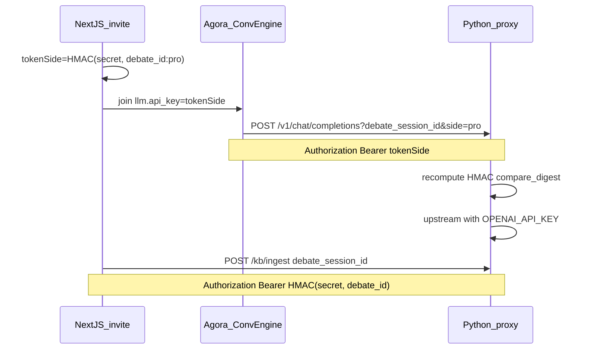

# Per-debate HMAC proxy authentication

## Goal

Protect all debate proxy routes so a leaked ngrok/Railway URL is not enough. Use **one shared master secret** in env (`PROXY_MASTER_SECRET`) on Next.js and Python proxy; derive **per-debate (and per-side) tokens** with HMAC-SHA256. Vendor keys (`OPENAI_API_KEY`, `XAI_API_KEY`) stay on the proxy only.

## Status

| Phase | Repo | Status |
|-------|------|--------|
| **Phase 2** — Python proxy verify | `custom-xAI-mllm` (this repo) | **Done** — `src/proxy_auth.py`, all routes wired, 79 tests |
| **Phase 1** — Next.js derive + invite | Debate app (separate repo) | In progress / E2E confirmed |

Legacy static `PROXY_AUTH_TOKEN` / `MLLM_PROXY_AUTH_TOKEN` **removed** from Python proxy — HMAC-only when secret is set.

## Endpoint coverage (implemented in Python)

| Endpoint | Auth token type | Public without secret? |
|----------|-----------------|------------------------|
| `POST /v1/chat/completions` | Side (`debate_id:side`) | Yes (dev only) |
| `WS /realtime` | Side | Yes (dev only) |
| `POST /kb/ingest` | Session (`debate_id`) | Yes (dev only) |
| `GET /sessions` | Session + `?debate_session_id=` required | Yes (dev only) |
| `POST /inject/{session_id}` | Side (from session record) | Yes (dev only) |
| `GET /kb` | Session + `?debate_session_id=` required; list-all blocked | Yes (dev only) |
| `GET /health` | None | Always public |

When `PROXY_MASTER_SECRET` is non-empty, all protected routes return `401` (HTTP) or close WS with `1008` (reported as `403` on handshake) without a valid token.



## Shared contract (both repos must match exactly)

| Item | Value |
|------|--------|
| Env var | `PROXY_MASTER_SECRET` (same string on Next.js + Python) |
| Side token message | `{debate_session_id}:{side}` e.g. `debate-abc123:pro` |
| Session token message | `{debate_session_id}` only |
| Algorithm | HMAC-SHA256, output **lowercase hex** |
| Header | `Authorization: Bearer <token>` |
| Dev | Empty/unset secret → skip auth (both sides) |

**Cross-language test vector** (`PROXY_MASTER_SECRET=test-secret-for-cross-check`):

- `derive_side_token("debate-abc", "pro")` → `dc31be4b05899e6e5ef6e5d060036a5db6bbbe0f028ba6b4390e9b27d21bb7a6`
- `derive_session_token("debate-abc")` → `a846a57a323925d0035f5d20e9ce1da2aeadbdd76e0e3363574f5193678948b7`

**Side values:** lowercase `pro` | `con`.

**Debate session id:** `debate-{sessionId}` — same as Agora channel name.

---

## Phase 2 — Python proxy (this repo) — DONE

### Implementation

| File | Role |
|------|------|
| `src/proxy_auth.py` | `derive_side_token`, `derive_session_token`, `verify_bearer`, `proxy_auth_headers` |
| `src/main.py` | Auth on `/realtime`, `/sessions`, `/inject` |
| `src/chat_completions.py` | Side token verify |
| `src/kb_ingest.py` | Session token verify |
| `src/kb_get.py` | Session token verify; block list-all when auth on |
| `tests/test_proxy_auth.py` | Cross-language vector |
| Route tests | 401/200 cases per route |

### Env

```env
PROXY_MASTER_SECRET=   # Shared with Next.js — empty = auth disabled (local dev only)
```

### Scripts / docs updated

- `scripts/inspect_kb.py`, `scripts/smoke_llm.py`, `scripts/smoke_inject.py`, `scripts/check_demo.py` — auto HMAC from `.env`
- `README.md`, `docs/prd.md`, `docs/spec.md` §7, `docs/integration.md`

### Verification (done)

1. Protected route without Bearer → `401`
2. Wrong token → `401`
3. `GET /kb` without `debate_session_id` when auth on → `401`
4. Valid session token → `200`
5. Agora `/v1/chat/completions` and `/realtime` with invite side token → E2E confirmed
6. Node/Python test vector match confirmed in debate app

---

## Phase 1 — Next.js (debate app repo)

### 1. `src/lib/mllm-proxy.ts`

- `deriveDebateProxySideToken(debateSessionId, side)` — Agora + inject
- `deriveDebateProxySessionToken(debateSessionId)` — `/kb/ingest`, `/sessions`, `GET /kb`
- `proxyHeadersForSide` / `proxyHeadersForSession` — **no legacy static Bearer fallback**

### 2. `app/api/agent/invite/route.ts`

- Set `llm.api_key` / `mllm.api_key` = side HMAC token
- Do **not** inject vendor keys for proxy paths
- `llm.vendor = "custom"` for cascade LLM through proxy

### 3. `.env`

```env
PROXY_MASTER_SECRET=<same-as-python>   # required in prod
```

### 4. Tests

- Fixed HMAC vector must match Python `tests/test_proxy_auth.py`

---

## Rollout order (completed for proxy)

1. ~~Deploy Phase 2 Python with HMAC on all routes + `GET /kb` protected~~ **Done**
2. Deploy Phase 1 Next.js with matching `PROXY_MASTER_SECRET` **Done in practice (E2E confirmed)**
3. ~~Remove legacy static tokens~~ **Done on Python side**

## References

- [spec.md](./spec.md) §7 — full auth contract
- [prd.md](./prd.md) — API surface + acceptance criteria
- [integration.md](./integration.md) — debate app wiring
