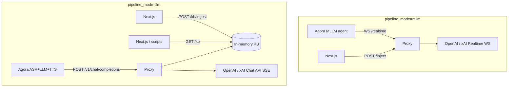

# PRD: Custom MLLM + LLM Proxy

## Overview

A **unified HTTP/WebSocket proxy** for the Agora debate demo app. It supports two agent pipelines on the **same host**:

| Pipeline | Agora path | Proxy routes | Upstream |
|----------|------------|--------------|----------|
| **MLLM** (voice-to-voice) | `mllm.url` → WebSocket | `WS /realtime` + `POST /inject/{session_id}` | OpenAI / xAI **Realtime** API |
| **Cascade LLM** (ASR → LLM → TTS) | `llm.url` → HTTP | `POST /kb/ingest` + `POST /v1/chat/completions` | OpenAI / xAI **Chat Completions** API |

Both pipelines use **`pipeline_mode`** query routing (`mllm` vs `llm`), shared `debate_session_id` + `side` (`pro` | `con`) scoping, and **server-side API keys** (never forwarded from Agora).

| Item | Value |
|------|-------|
| **Repo** | `custom-xAI-mllm` (this repo) |
| **Consumer** | Debate demo app (separate Next.js repo) |
| **Audience** | Internal demo |
| **Status** | MLLM + cascade LLM **confirmed working** (local + ngrok E2E) |
| **Related docs** | [debate-architcture.md](./debate-architcture.md), [integration.md](./integration.md), [optional-llm-pipeline-plan.md](./optional-llm-pipeline-plan.md), [proxy_llm_phase_2_01af85fe.plan.md](./proxy_llm_phase_2_01af85fe.plan.md) |

---

## Problem

Agora's [`/think`](https://docs.agora.io/en/conversational-ai/rest-api/agent/think) API injects context as synthetic user input, but delivery depends on agent state (LISTENING vs THINKING vs SPEAKING). Using `interrupt` mid-sentence causes chaotic pivots.

**MLLM mode:** A custom proxy injects live X via `conversation.item.create` on the upstream Realtime WebSocket (`POST /inject/{session_id}`).

**Cascade LLM mode:** There is no MLLM WebSocket. Live X reaches the LLM through an in-memory **knowledge buffer** (`POST /kb/ingest`) that the proxy injects on each chat completion (`POST /v1/chat/completions`).

---

## Goals

### Delivered (v1 + Phase 2)

1. **MLLM pass-through proxy** — Voice in → voice out; OpenAI Realtime-style event relay
2. **Dual provider MLLM** — `provider=openai|xai` on `/realtime`; models from env (`OPENAI_MODEL`, `XAI_MODEL`)
3. **MLLM live context inject** — `POST /inject/{session_id}` wired to upstream `conversation.item.create`
4. **Session discovery** — `GET /sessions?debate_session_id=` for pro/con `session_id` mapping
5. **Cascade LLM gateway** — OpenAI-compatible `POST /v1/chat/completions` with SSE streaming
6. **KB ingest + inspect** — `POST /kb/ingest`, `GET /kb` (in-memory; Redis deferred)
7. **Pipeline routing** — `pipeline_mode=mllm` on `/realtime`; `pipeline_mode=llm` on chat completions
8. **Structured logging** — WS relay, inject, kb ingest, chat completions events
9. **Deployable** — Localhost + ngrok; Railway-ready

### Future (not implemented)

- Redis persistence for KB (in-memory only today)
- Auth on `/kb/*` and `/v1/chat/completions` (open for v1)
- MCP / `x_search` tools on MLLM upstream
- Gemini or other LLM providers in cascade mode
- `model` query param on MLLM `/realtime` (today: env defaults only)

---

## Architecture



### Session model (MLLM)

- One Agora MLLM connection = one proxy `session_id` (UUID) = one upstream Realtime WebSocket
- **`debate_session_id`** (debate app) + **`side`** (`pro` | `con`) scope inject and WS uniqueness
- **`session_id`** (proxy UUID) used only for `POST /inject/{session_id}`

### Knowledge model (cascade LLM)

- **`debate_session_id`** + **`side`** key the in-memory KB (not proxy `session_id`)
- Next.js pushes `{ pro?, con? }` summaries via `POST /kb/ingest`
- Chat completions inject **latest** point per side as `[LIVE THREAD] {text}` system message
- Agora `turn_id` / `timestamp` stripped before upstream (logging only)

---

## API surface

All routes on one host (e.g. `https://<proxy>`).

| Method | Path | `pipeline_mode` | Caller | Purpose |
|--------|------|-----------------|--------|---------|
| `GET` | `/health` | — | Ops | Health + active MLLM session count |
| `GET` | `/sessions` | — | Debate app | List MLLM sessions; filter by `debate_session_id` |
| `POST` | `/inject/{session_id}` | — | Debate app | MLLM live X inject |
| `WS` | `/realtime` | **`mllm`** required | Agora MLLM | Voice relay |
| `POST` | `/kb/ingest` | — | Debate app | Store live X summaries (pro/con) |
| `GET` | `/kb` | — | Debug / scripts | Read in-memory KB (`?debate_session_id=` or all) |
| `POST` | `/v1/chat/completions` | **`llm`** required | Agora cascade | Chat gateway + KB injection + SSE |

### Example URLs

**MLLM (pro agent):**
```
wss://<proxy>/realtime?pipeline_mode=mllm&debate_session_id=debate-abc&side=pro&provider=xai
```

**Cascade LLM (pro agent):**
```
https://<proxy>/v1/chat/completions?pipeline_mode=llm&debate_session_id=debate-abc&side=pro&provider=openai&model=gpt-4o-mini
```

### KB ingest body

```json
{
  "debate_session_id": "debate-abc",
  "pro": { "id": "<tweetId>", "text": "<pro summary>" },
  "con": { "id": "<tweetId>", "text": "<con summary>" }
}
```

`pro` and/or `con` optional per request. Dedupe by tweet `id` per side.

### Chat completions behavior

- Query params: `provider`, `model` (**required**; override body/env)
- Body: OpenAI Chat Completions format; `stream: true` required
- Strips Agora-only fields: `turn_id`, `timestamp`, `context`
- Forwards `max_tokens`, `temperature`, etc. when present at **top level** of body
- API keys from proxy env only

---

## Technical decisions

| Decision | Choice | Rationale |
|----------|--------|-----------|
| Language | Python 3.11+ | asyncio, Starlette, Railway |
| Framework | Starlette + uvicorn | HTTP + WebSocket in one process |
| MLLM model source | Env (`OPENAI_MODEL`, `XAI_MODEL`) | Realtime WS URL embeds model |
| LLM model source | Query param (env fallback) | Per-agent routing from debate app `llm.url` |
| KB storage | In-memory | v1; `# TODO: Redis` in code |
| Auth | Optional `PROXY_AUTH_TOKEN` | MLLM inject + `/sessions`; KB/chat open in v1 |
| Providers | OpenAI + xAI | Match debate app cascade + MLLM config |

---

## Environment variables

```env
# API keys (server-side only)
XAI_API_KEY=
OPENAI_API_KEY=

# MLLM Realtime models (embedded in upstream WS URL)
XAI_MODEL=grok-voice-latest
OPENAI_MODEL=gpt-realtime

# Cascade LLM defaults (fallback; query param preferred)
XAI_CHAT_MODEL=grok-4.3
OPENAI_CHAT_MODEL=gpt-4o-mini

PROXY_AUTH_TOKEN=      # Optional
PORT=8081
HOST=0.0.0.0
LOG_LEVEL=info
LOG_AUDIO=0
```

Debate app env (consumer repo): `MLLM_PROXY_HTTP_URL`, `MLLM_PROXY_WS_URL` — see [integration.md](./integration.md).

---

## Acceptance criteria

### MLLM (done)

- [x] `WS /realtime?pipeline_mode=mllm` accepts Agora; relays to xAI/OpenAI Realtime
- [x] Pro + con dual sessions with same `debate_session_id`, different `side`
- [x] `POST /inject/{session_id}` sends `conversation.item.create` upstream
- [x] `GET /sessions?debate_session_id=` returns pro/con `session_id`s
- [x] Rejects `/realtime` without `pipeline_mode=mllm`
- [x] Human voice → agent voice (confirmed E2E)

### Cascade LLM (done)

- [x] `POST /kb/ingest` stores pro/con summaries per debate
- [x] `GET /kb?debate_session_id=` returns stored points
- [x] `POST /v1/chat/completions?pipeline_mode=llm&...` streams SSE to upstream
- [x] Latest KB point injected as `[LIVE THREAD]` when present
- [x] `provider` + `model` from query params forwarded upstream
- [x] Rejects chat without `pipeline_mode=llm` or `stream: false`
- [x] Debate app E2E with live X → KB → agent (confirmed)

### Ops

- [x] `GET /health` returns 200
- [x] `pytest` — 58+ tests passing
- [x] ngrok local dev documented
- [ ] Railway production deploy (optional)

---

## Project structure

```
custom-xAI-mllm/
├── src/
│   ├── main.py              # Routes: health, sessions, inject, kb, chat, realtime WS
│   ├── session.py           # MLLM session manager + scope parsing
│   ├── relay.py             # Bidirectional WS relay
│   ├── inject.py            # MLLM conversation.item.create
│   ├── upstream.py          # resolve_upstream (WS) + resolve_chat_upstream (HTTP)
│   ├── pipeline.py          # pipeline_mode validation
│   ├── kb.py                # In-memory KB store
│   ├── kb_ingest.py         # POST /kb/ingest
│   ├── kb_get.py            # GET /kb
│   ├── chat_completions.py  # POST /v1/chat/completions SSE proxy
│   ├── config_mapper.py     # Agora mllm → xAI session.update (reference)
│   ├── settings.py
│   └── logging.py
├── scripts/
│   ├── smoke_xai.py         # Direct xAI Realtime smoke
│   ├── smoke_inject.py      # MLLM sessions + inject smoke
│   ├── smoke_llm.py         # KB ingest + GET + chat completions smoke
│   └── inspect_kb.py        # GET /kb CLI
├── tests/                   # Unit + route tests (kb, chat, pipeline, inject, relay, …)
├── docs/
│   ├── prd.md               # This file
│   ├── spec.md              # Implementation spec
│   └── integration.md     # Debate app integration guide
├── requirements.txt
├── Dockerfile
├── railway.toml
└── .env.example
```

---

## Debate app integration (consumer repo)

| Mode | Debate app sends | Proxy receives |
|------|------------------|----------------|
| MLLM on | `mllm.url` with `pipeline_mode=mllm`, `debate_session_id`, `side`, `provider` | WS `/realtime` |
| MLLM on + live X | `POST /inject/{session_id}` after `GET /sessions` | Per-turn context |
| MLLM off (default) | `llm.url` with `pipeline_mode=llm`, `provider`, `model`, scope params | HTTP chat |
| MLLM off + live X | `POST /kb/ingest` with classified tweets | KB buffer |

Phase 1 (Next.js) complete per [optional-llm-pipeline-plan.md](./optional-llm-pipeline-plan.md). Phase 2 (this repo) complete per [proxy_llm_phase_2_01af85fe.plan.md](./proxy_llm_phase_2_01af85fe.plan.md).

---

## Risks and mitigations

| Risk | Mitigation |
|------|------------|
| KB lost on proxy restart | Documented; Redis TODO for v2 |
| Nested Agora `params` not forwarded to chat upstream | Log payload; flatten `params` if needed |
| MLLM without `pipeline_mode=mllm` | WS rejected with 1008 |
| ngrok URL changes | Update debate app env vars |

---

## Resolved decisions (traceability)

| Question | Answer |
|----------|--------|
| v1 success | Single-agent voice + dual-agent debate (both modes) |
| MLLM inject | Fully wired (`conversation.item.create`; optional `response.create`) |
| Cascade LLM providers | OpenAI + xAI only |
| LLM model routing | Query params on `llm.url`; env chat models as fallback |
| KB selection | Latest by `ingested_at` per `(debate_session_id, side)` |
| `pipeline_mode` | Required on `/realtime` (`mllm`) and `/v1/chat/completions` (`llm`) |
| API keys | Server-side in proxy only |
| Session ID (MLLM) | Proxy generates UUID; debate app discovers via `GET /sessions` |
| Session ID (LLM KB) | `debate_session_id` from debate app (e.g. `debate-{sessionId}`) |
