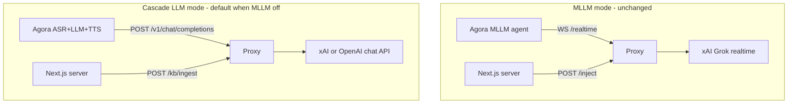

# Proxy LLM Phase 2 — handoff plan

## Why we are doing this

The debate app supports two agent pipelines on the **same proxy host**:



**Problem:** In MLLM mode, live X context is pushed per-turn via WebSocket inject (`POST /inject/{session_id}`). In cascade LLM mode there is no MLLM WebSocket — Agora uses a classic **ASR → LLM → ElevenLabs TTS** pipeline. Live X must reach the LLM through a **knowledge buffer** the proxy injects on each chat completion.

**Goal:** Add two HTTP endpoints to the existing MLLM proxy without breaking `/realtime`, `/inject`, or `/sessions`.

---

## What the Next.js app already does (Phase 1 — done)

| Area | Status | Key files |
|------|--------|-----------|
| Default pipeline | MLLM **off** → cascade LLM | [`src/screens/podcast/PodcastSetupScreen.tsx`](src/screens/podcast/PodcastSetupScreen.tsx) |
| Agent invite | `asr` + `llm` + `tts`; `llm.url` built with query params | [`src/utils/podcastAgentSettings.ts`](src/utils/podcastAgentSettings.ts) → `buildLlmPodcastAgentSettings()` |
| URL helpers | Single HTTP base `MLLM_PROXY_HTTP_URL` derives both paths | [`src/lib/mllm-proxy.ts`](src/lib/mllm-proxy.ts) |
| Live X routing | Classified tweets → `POST /kb/ingest` (not `/inject`) | [`src/lib/podcastSearchFeed.ts`](src/lib/podcastSearchFeed.ts), [`src/lib/podcastRealtimeFeed.ts`](src/lib/podcastRealtimeFeed.ts) |
| Turn orchestrator | **Inactive** in LLM mode (`useMllm` must be true) | [`src/hooks/podcast/usePodcastMllmTurnOrchestrator.ts`](src/hooks/podcast/usePodcastMllmTurnOrchestrator.ts) |
| Prompts | LLM-specific system prompts (no inject-prefix mechanics) | [`src/config/podcast/prompts.ts`](src/config/podcast/prompts.ts) |
| Studio UI | Delivery path shows `kb_ingest` | [`src/components/podcast/PodcastThinkApiPanel.tsx`](src/components/podcast/PodcastThinkApiPanel.tsx) |

### URL derivation (one env var)

From [`src/lib/mllm-proxy.ts`](src/lib/mllm-proxy.ts):

```
MLLM_PROXY_HTTP_URL=https://<proxy-host>
  → POST https://<proxy-host>/kb/ingest          (Next.js)
  → POST https://<proxy-host>/v1/chat/completions?...  (Agora, when LLM_PROXY_HTTP_URL unset)
MLLM_PROXY_WS_URL=wss://<proxy-host>/realtime    (MLLM only)
```

`LLM_PROXY_HTTP_URL` is an **optional override** for chat URL only. For ngrok, set only `MLLM_PROXY_HTTP_URL`.

### Example Agora `llm.url` (Pro host)

```
https://<proxy>/v1/chat/completions?pipeline_mode=llm&debate_session_id=debate-eea3c9e5&side=pro&provider=openai&model=gpt-4o-mini
```

Guest (Con) gets `side=con` and may use `provider=xai&model=grok-4.3`.

### KB ingest caller contract

Next.js calls `postKbIngest()` immediately after tweet classification (no turn handoff):

```json
{
  "debate_session_id": "debate-{sessionId}",
  "pro": { "id": "<tweetId>", "text": "<pro summary ~500 chars>" },
  "con": { "id": "<tweetId>", "text": "<con summary ~500 chars>" }
}
```

- `pro` and/or `con` are optional per request; one or both may be present.
- `text` is the raw classified summary (not the MLLM imperative inject prefix).
- Same `debate_session_id` as in Agora `llm.url` query string.
- Auth: optional `Authorization: Bearer {MLLM_PROXY_AUTH_TOKEN}` from Next.js ([`proxyHeaders()`](src/lib/mllm-proxy.ts)).

---

## What the proxy app must implement (Phase 2 — pending)

**Scope:** Add two endpoints. Do **not** modify existing MLLM WS/inject behavior.

### 1. `POST /kb/ingest`

**Purpose:** Store live X points in an in-memory KB keyed by debate + side.

**Request**

| Field | Type | Required |
|-------|------|----------|
| `debate_session_id` | string | yes |
| `pro` | `{ id, text }` | no |
| `con` | `{ id, text }` | no |

**Behavior**

```ts
if (body.pro) store(debate_session_id, "pro", body.pro.id, body.pro.text);
if (body.con) store(debate_session_id, "con", body.con.id, body.con.text);
```

**Recommended storage**

- In-memory map: `Map<debate_session_id, { pro: Point[], con: Point[] }>`
- Dedupe by `id` per side; keep newest-first or cap at N (e.g. 20).
- TTL cleanup when debate ends (optional; session-scoped eviction on timeout is fine for v1).

**Response (200)**

```json
{ "ok": true, "debate_session_id": "debate-xxx", "stored": { "pro": true, "con": false } }
```

**Errors:** 400 missing `debate_session_id`; 401 if `PROXY_AUTH_TOKEN` set and Bearer missing/wrong.

---

### 2. `POST /v1/chat/completions`

**Purpose:** OpenAI-compatible LLM gateway for Agora cascade agents. Read routing from **query string** (same pattern as MLLM WS `/realtime`).

**Query params (required for `pipeline_mode=llm`)**

| Param | Values |
|-------|--------|
| `pipeline_mode` | `llm` |
| `debate_session_id` | `debate-{sessionId}` |
| `side` | `pro` \| `con` |
| `provider` | `openai` \| `xai` |
| `model` | e.g. `gpt-4o-mini`, `grok-4.3` |

**Request body:** Standard OpenAI chat completions (messages, stream, model, max_tokens, temperature). Agora sends `system_messages` from invite plus conversation history.

**Behavior**

1. Parse query params; reject if `pipeline_mode !== "llm"` or missing `debate_session_id` / `side`.
2. Load KB for `(debate_session_id, side)` — Pro agent only sees `pro` points; Con only sees `con` points.
3. If a recent point exists, **prepend or append** a system (or user) message before upstream forward, e.g.:
   ```
   [LIVE THREAD] {most_recent_point.text}
   ```
   Do not expose tweet `id` or @handles in spoken context (matches debate prompts).
4. Forward to upstream using **proxy-owned API keys** (not Agora's masked key):
   - `provider=openai` → `https://api.openai.com/v1/chat/completions`
   - `provider=xai` → `https://api.x.ai/v1/chat/completions`
5. Stream OpenAI-compatible **SSE** back to Agora when `stream: true`.

**Non-goals for v1**

- No WebSocket session tracking (unlike MLLM `/realtime`).
- No `GET /sessions` for LLM mode.
- Gemini not supported in cascade mode.

**Proxy env (suggested)**

```properties
OPENAI_API_KEY=...
XAI_API_KEY=...
PROXY_AUTH_TOKEN=...        # optional; Next.js sends on /kb/ingest
```

---

## Deliverable: create [`docs/debate/proxy-llm.md`](docs/debate/proxy-llm.md)

Standalone handoff doc for the proxy repo team. Structure:

1. **Context** — why cascade LLM exists; MLLM unchanged
2. **Architecture diagram** — four paths on one host
3. **Phase 1 summary** — what Next.js sends (invite URL, ingest body, auth)
4. **Phase 2 spec** — `/kb/ingest` and `/v1/chat/completions` contracts (request/response, storage, injection, upstream routing, streaming)
5. **Env alignment** — `MLLM_PROXY_HTTP_URL` as single base; optional auth token naming
6. **MLLM vs LLM comparison table** — inject vs kb_ingest, turn timing, session IDs
7. **Verification checklist** — curl examples + E2E steps with debate app
8. **Out of scope** — proxy repo location, deployment, ngrok setup

Also add a one-line cross-link from [`docs/debate/optional-llm-pipeline-plan.md`](docs/debate/optional-llm-pipeline-plan.md) pointing to `proxy-llm.md` (optional, minimal).

---

## Verification matrix (after proxy implementation)

1. `curl POST /kb/ingest` with pro-only, con-only, and both — 200 each
2. `curl POST /v1/chat/completions?pipeline_mode=llm&...` — streams SSE; response reflects injected KB
3. Debate app: MLLM off, live X on → Think panel shows `kb_ingest` delivery path
4. Agent speaks with thread context woven in (not verbatim @handles)
5. MLLM regression: WS `/realtime` + `/inject` still work when MLLM enabled

---

## What is NOT in this step

- Proxy code changes (separate repo — user implements from `proxy-llm.md`)
- Next.js code changes (Phase 1 complete unless env doc clarification desired)
- E2E pass (blocked until proxy endpoints are live)
