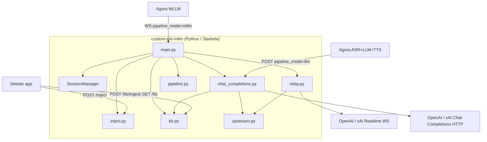

# spec — Custom MLLM + LLM Proxy (Implementation Spec)

**Parent doc:** [prd.md](./prd.md)  
**References:** [xAI Voice Agent API](https://docs.x.ai/developers/model-capabilities/audio/voice-agent), [Agora xAI MLLM](https://docs.agora.io/en/conversational-ai/models/mllm/xai), [Agora Custom LLM](https://docs.agora.io/en/conversational-ai/develop/custom-llm)

---

## 1. Purpose

Implementation spec for the **unified debate proxy** supporting:

1. **MLLM** — WebSocket relay to OpenAI/xAI Realtime + HTTP inject for live X
2. **Cascade LLM** — OpenAI-compatible chat completions gateway + in-memory KB for live X

**Status:** Both pipelines confirmed working E2E with the debate Next.js app (ngrok + local proxy).

---

## 2. System components



### Module responsibilities

| Module | File | Responsibility |
|--------|------|----------------|
| Entry | `src/main.py` | HTTP + WS routes, auth helpers, lifespan |
| Sessions | `src/session.py` | MLLM session registry, `parse_session_scope()` |
| Relay | `src/relay.py` | Bidirectional Realtime JSON relay + structured logs |
| Inject | `src/inject.py` | MLLM `conversation.item.create` (+ optional `response.create`) |
| Upstream | `src/upstream.py` | `resolve_upstream()` (WS), `resolve_chat_upstream()` (HTTP) |
| Pipeline | `src/pipeline.py` | `parse_pipeline_mode(expected)` — `mllm` \| `llm` |
| KB store | `src/kb.py` | In-memory points per `(debate_session_id, side)` |
| KB ingest | `src/kb_ingest.py` | `POST /kb/ingest` |
| KB get | `src/kb_get.py` | `GET /kb` |
| Chat | `src/chat_completions.py` | SSE proxy, KB injection, Agora field stripping |
| Config | `src/config_mapper.py` | Agora mllm → xAI `session.update` (reference / tests) |
| Settings | `src/settings.py` | Pydantic env config |
| Logging | `src/logging.py` | structlog JSON + audio redaction |

---

## 3. Pipeline routing (`pipeline_mode`)

| Route | Required `pipeline_mode` | On missing/wrong |
|-------|--------------------------|------------------|
| `WS /realtime` | `mllm` | Close WS code `1008` |
| `POST /v1/chat/completions` | `llm` | HTTP `400` |

Other routes (`/health`, `/sessions`, `/inject`, `/kb`, `/kb/ingest`) do not use `pipeline_mode`.

---

## 4. MLLM connection lifecycle

### 4.1 Downstream connect (Agora → Proxy)

```
wss://<proxy>/realtime?pipeline_mode=mllm&debate_session_id=<id>&side=pro|con&provider=openai|xai
Optional: Authorization: Bearer <HMAC side or session token>
```

| Query param | Required | Notes |
|-------------|----------|-------|
| `pipeline_mode` | yes | Must be `mllm` |
| `debate_session_id` | yes* | e.g. `debate-abc`; regex `[a-zA-Z0-9_-]{1,128}` |
| `side` | yes* | `pro` or `con` |
| `provider` | no | `openai` or `xai`; default `xai` |

\*Both `debate_session_id` and `side` required together when scoping.

**Steps:**

1. Validate auth if `PROXY_MASTER_SECRET` set (see §7).
2. Validate `pipeline_mode=mllm`.
3. Parse `debate_session_id` + `side`; reject duplicate active scope.
4. Generate proxy `session_id` (UUID).
5. `resolve_upstream(provider)` → Realtime WS URL with `OPENAI_MODEL` or `XAI_MODEL` from env.
6. Relay loop; log `session.created`, `session.upstream_connected`, `ws.message`, `session.closed`.

### 4.2 Upstream (Proxy → Realtime API)

| Provider | URL pattern |
|----------|-------------|
| xAI | `wss://api.x.ai/v1/realtime?model={XAI_MODEL}` |
| OpenAI | `wss://api.openai.com/v1/realtime?model={OPENAI_MODEL}` |

Auth: `Authorization: Bearer {XAI_API_KEY | OPENAI_API_KEY}` from env only.

### 4.3 Relay rules

- Verbatim JSON relay both directions
- Parse JSON only for logging; redact base64 audio unless `LOG_AUDIO=1`
- Preserve message order per direction

---

## 5. Cascade LLM lifecycle

### 5.1 KB ingest (Debate app → Proxy)

```
POST /kb/ingest
Content-Type: application/json
```

```json
{
  "debate_session_id": "debate-abc",
  "pro": { "id": "<tweetId>", "text": "<summary>" },
  "con": { "id": "<tweetId>", "text": "<summary>" }
}
```

- `pro` and/or `con` optional per request; at least one required
- Dedupe by `id` per side; update `text` + `ingested_at` on re-ingest
- No cap; in-memory only (`# TODO: Redis` in `kb.py`)
- When `KB_AUDIT_LOG_DIR` is set, append `kb.ingest` JSONL line per side stored

**Response `200`:**
```json
{ "ok": true, "debate_session_id": "debate-abc", "stored": { "pro": true, "con": false } }
```

### 5.2 KB inspect (debug)

```
GET /kb?debate_session_id=debate-abc
GET /kb
```

Returns pro/con point lists (newest first) with `id`, `text`, `ingested_at`.  
CLI: `python scripts/inspect_kb.py --debate-session-id debate-abc`

### 5.2.1 KB audit logs (optional)

Set `KB_AUDIT_LOG_DIR=logs` (empty = disabled).

Writes pretty JSON per debate and side:

- `logs/{debate_session_id}/pro.json`
- `logs/{debate_session_id}/con.json`

**`kb.ingest`** — tweet stored: `point_id`, `text`, `side_point_count`

**`chat.completion`** — after upstream stream completes:

- `request` — OpenAI shape: `model`, `stream`, `messages` (role + content only)
- `response.assistant_reply` — streamed LLM text for that turn
- `kb` — `point_ids`, `point_count`, `injected`; plus `turn_id`, `provider`, `ts`

### 5.3 Chat completions (Agora → Proxy → upstream)

```
POST /v1/chat/completions?pipeline_mode=llm&debate_session_id=debate-abc&side=pro&provider=openai&model=gpt-4o-mini
```

**Query params (required):** `pipeline_mode=llm`, `debate_session_id`, `side`, `provider`, `model`

**Body:** OpenAI Chat Completions (Agora custom LLM format). `stream: true` required.

**Proxy behavior:**

1. Validate query params + `pipeline_mode=llm`
2. Extract `turn_id`, `timestamp` for logs only
3. `kb_store.format_live_thread(debate_session_id, side)` → if points exist, insert system message with full own-side thread immediately before the last `user` message (`[LIVE THREAD - PRO|CON]` bullet list, oldest→newest; capped by `KB_INJECT_MAX_POINTS_PER_SIDE`, `0` = unlimited; append if no `user` in history)
4. Append audit record when `KB_AUDIT_LOG_DIR` is set (`chat.completion` with OpenAI `request` + `response.assistant_reply`)
5. Build upstream payload: strip `turn_id`, `timestamp`, `context`; set `model` from query param; force `stream: true`
6. `resolve_chat_upstream(provider, model)` → HTTP chat API
7. Stream SSE back to Agora; append `data: [DONE]\n\n` if upstream omits it

**Model resolution:** Query param `model` wins; `OPENAI_CHAT_MODEL` / `XAI_CHAT_MODEL` env vars are fallback (route requires query param today).

**Other body fields:** `max_tokens`, `temperature`, etc. forwarded when at top level of request body.

---

## 6. HTTP API reference

### 6.1 `GET /health`

```json
{ "status": "ok", "version": "<semver>", "active_sessions": 2 }
```

`active_sessions` = active MLLM WebSocket sessions only.

### 6.2 `GET /sessions`

```
GET /sessions?debate_session_id=debate-abc
Authorization: Bearer <session_hmac>
```

Auth: session token (§7). `debate_session_id` query param required when `PROXY_MASTER_SECRET` set.

MLLM session discovery for inject targeting:

```json
{
  "sessions": [
    {
      "session_id": "uuid",
      "debate_session_id": "debate-abc",
      "side": "pro",
      "created_at": "ISO8601",
      "upstream_connected": true,
      "provider": "xai",
      "model": "grok-voice-latest"
    }
  ]
}
```

### 6.3 `POST /inject/{session_id}`

See prd.md. Wired to upstream `conversation.item.create`.  
Auth: side token from session's `debate_session_id` + `side` (§7).  
`404` missing session; `409` upstream not ready; `401` missing/invalid Bearer.

### 6.4 `POST /kb/ingest`

See §5.1. Auth: session token (§7). `401` if missing/invalid when `PROXY_MASTER_SECRET` set.

### 6.5 `GET /kb`

See §5.2. Auth: session token + required `debate_session_id` query param when auth enabled; list-all blocked. `401` without token or param.

### 6.6 `POST /v1/chat/completions`

See §5.3. Auth: side token (§7). `401` if missing/invalid when secret set.

---

## 7. Authentication

Per-debate HMAC auth via shared `PROXY_MASTER_SECRET` (same value on Next.js and proxy). Vendor keys (`XAI_API_KEY`, `OPENAI_API_KEY`) stay on the proxy only.

| Item | Value |
|------|--------|
| Side token message | `{debate_session_id}:{side}` e.g. `debate-abc:pro` |
| Session token message | `{debate_session_id}` only |
| Algorithm | HMAC-SHA256, lowercase hex, UTF-8 |
| Header | `Authorization: Bearer <token>` |
| Dev | Empty `PROXY_MASTER_SECRET` → skip auth |

**Cross-language test vector** (`PROXY_MASTER_SECRET=test-secret-for-cross-check`):

- `derive_side_token("debate-abc", "pro")` → `dc31be4b05899e6e5ef6e5d060036a5db6bbbe0f028ba6b4390e9b27d21bb7a6`
- `derive_session_token("debate-abc")` → `a846a57a323925d0035f5d20e9ce1da2aeadbdd76e0e3363574f5193678948b7`

| Route | Token type |
|-------|------------|
| `WS /realtime` | Side (query `debate_session_id` + `side`) |
| `POST /v1/chat/completions` | Side |
| `POST /kb/ingest` | Session (body `debate_session_id`) |
| `GET /kb` | Session; list-all blocked when auth enabled |
| `GET /sessions` | Session (query `debate_session_id` required when HMAC-only) |
| `POST /inject/{session_id}` | Side (from session record) |
| `GET /health` | None (public) |

| Hop | Mechanism |
|-----|-----------|
| Agora → proxy routes | HMAC side token via invite `llm.api_key` / `mllm.api_key` |
| Debate app → `/kb/ingest`, `/sessions`, `/inject` | HMAC session or side token |
| Proxy → upstream | Provider API keys from env always |

---

## 8. Logging

**WS messages:** `ws.message` with `direction`, `type`, `session_id`, redacted `payload`

**Lifecycle:** `session.created`, `session.upstream_connected`, `session.closed`, `session.error`

**MLLM inject:** `inject.sent`

**LLM:** `kb.ingest`, `chat_completions.request` (includes `kb_injected`, `kb_point_count`, `kb_thread_chars`, `turn_id`, `timestamp`); optional JSONL audit via `KB_AUDIT_LOG_DIR`

---

## 9. Environment

```env
XAI_API_KEY=xai-...
XAI_MODEL=grok-voice-latest          # MLLM Realtime WS
XAI_CHAT_MODEL=grok-4.3              # Cascade LLM fallback

OPENAI_API_KEY=sk-...
OPENAI_MODEL=gpt-realtime            # MLLM Realtime WS
OPENAI_CHAT_MODEL=gpt-4o-mini        # Cascade LLM fallback

PROXY_MASTER_SECRET=   # Shared with Next.js — HMAC per-debate auth (empty = auth disabled)
PORT=8081
HOST=0.0.0.0
LOG_LEVEL=info
LOG_AUDIO=0
KB_INJECT_MAX_POINTS_PER_SIDE=30     # 0 = unlimited per side per chat turn
KB_AUDIT_LOG_DIR=logs                # writes logs/{debate_session_id}/pro.json + con.json
```

---

## 10. File layout

```
custom-xAI-mllm/
├── docs/
│   ├── prd.md
│   ├── spec.md
│   ├── integration.md
│   ├── optional-llm-pipeline-plan.md
│   ├── debate_proxy_hmac_auth_7b5d3263.plan.md
│   └── proxy_llm_phase_2_01af85fe.plan.md
├── scripts/
│   ├── smoke_xai.py
│   ├── smoke_inject.py      # MLLM: sessions + inject
│   ├── smoke_llm.py         # LLM: ingest + GET /kb + chat
│   ├── inspect_kb.py        # GET /kb CLI
│   ├── check_demo.py        # Live demo: sessions + KB monitor
│   └── run_tests.py         # Test catalog runner
├── src/
│   ├── main.py
│   ├── session.py
│   ├── relay.py
│   ├── inject.py
│   ├── upstream.py
│   ├── pipeline.py
│   ├── kb.py
│   ├── kb_ingest.py
│   ├── kb_get.py
│   ├── chat_completions.py
│   ├── proxy_auth.py        # HMAC derive/verify
│   ├── config_mapper.py
│   ├── settings.py
│   └── logging.py
└── tests/
    ├── test_config_mapper.py
    ├── test_inject.py
    ├── test_inject_route.py
    ├── test_relay.py
    ├── test_upstream.py
    ├── test_pipeline.py
    ├── test_realtime_pipeline_mode.py
    ├── test_kb.py
    ├── test_kb_ingest_route.py
    ├── test_kb_get_route.py
    ├── test_chat_completions.py
    ├── test_proxy_auth.py
    └── test_sessions_auth.py
```

---

## 11. Dependencies

```txt
websockets>=13.0
starlette>=0.38.0
uvicorn[standard]>=0.30.0
structlog>=24.0.0
pydantic-settings>=2.0.0
python-dotenv>=1.0.0
pytest>=8.0.0
pytest-asyncio>=0.24.0
httpx>=0.27.0
```

---

## 12. Implementation milestones

### Milestone 0–4 — MLLM (complete)

- [x] Scaffold, health, smoke_xai
- [x] Transparent WS relay
- [x] Agora MLLM E2E (ngrok)
- [x] `POST /inject/{session_id}` wired
- [x] `GET /sessions` with `debate_session_id` + `side`
- [x] OpenAI + xAI Realtime providers
- [x] `pipeline_mode=mllm` guard on `/realtime`

### Milestone 5 — Cascade LLM Phase 2 (complete)

- [x] `POST /kb/ingest` in-memory store
- [x] `GET /kb` inspect endpoint
- [x] `POST /v1/chat/completions` SSE proxy + KB injection
- [x] `pipeline_mode=llm` guard
- [x] OpenAI + xAI chat upstream
- [x] Tests + `smoke_llm.py` + `inspect_kb.py`
- [x] Debate app E2E confirmed

### Milestone 6 — Future

- [ ] Redis KB persistence
- [ ] Auth on `/kb` and `/v1/chat/completions`
- [ ] Flatten nested Agora `params` for chat upstream
- [ ] `model` query param on MLLM `/realtime`
- [ ] Railway production deploy

---

## 13. Testing

| Test | Command / file |
|------|----------------|
| Unit + routes | `.venv/bin/pytest -q` (79+ tests) |
| xAI direct | `python scripts/smoke_xai.py` |
| MLLM inject | `python scripts/smoke_inject.py --spawn` |
| LLM pipeline | `python scripts/smoke_llm.py --host 127.0.0.1:8081` |
| KB inspect | `python scripts/inspect_kb.py --debate-session-id debate-xxx` |
| Manual KB | `curl POST /kb/ingest` then `curl GET /kb?debate_session_id=...` |

---

## 14. Error handling

| Scenario | Action |
|----------|--------|
| Wrong `pipeline_mode` on WS | Close `1008` |
| Wrong `pipeline_mode` on chat | HTTP `400` |
| `stream: false` on chat | HTTP `400` |
| Upstream chat HTTP error | Log + SSE error chunk |
| Inject to dead session | HTTP `404` |
| Inject before upstream ready | HTTP `409` |
| Invalid `debate_session_id` on KB | HTTP `400` |
| Missing/invalid HMAC Bearer | HTTP `401` (HTTP routes); WS close `1008` (reported as HTTP `403` on handshake) |
| `GET /kb` without `debate_session_id` when auth on | HTTP `401` |

---

## 15. Acceptance checklist

### MLLM

- [x] `/realtime?pipeline_mode=mllm` relay works
- [x] Pro + con dual-agent via ngrok
- [x] `POST /inject/{session_id}` returns 200
- [x] `GET /sessions?debate_session_id=`
- [x] Structured WS logs

### Cascade LLM

- [x] `POST /kb/ingest` pro-only, con-only, both
- [x] `GET /kb` returns ingested points
- [x] Chat completions streams SSE with KB injection
- [x] Query `model` forwarded upstream
- [x] Debate app live X → `kb_ingest` path confirmed

### Auth

- [x] `PROXY_MASTER_SECRET` HMAC on all routes except `/health`
- [x] `src/proxy_auth.py` + `tests/test_proxy_auth.py` cross-language vector
- [x] Route tests for 401/200 auth cases

### Ops

- [x] `GET /health`
- [x] `pytest` green
- [ ] Railway `wss://` (optional)

---

## 16. v2 extension points

| Hook | Location | Planned use |
|------|----------|-------------|
| `KnowledgeBase` backend | `kb.py` | Redis persistence |
| `_build_upstream_payload` | `chat_completions.py` | Flatten Agora `params` object |
| `resolve_upstream` | `upstream.py` | `model` query param for MLLM WS |
| `on_upstream_event` | `relay.py` | Queue inject until `response.done` |
| `config_mapper` tools | `config_mapper.py` | MCP / x_search on MLLM |
