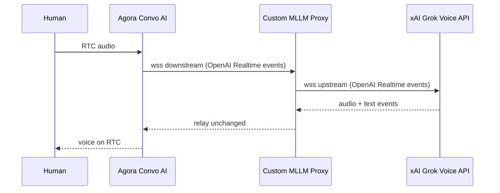

# PRD: Custom xAI MLLM Proxy (v1)

## Overview

Build a **transparent WebSocket proxy** that sits between Agora Conversational AI Engine and the xAI Grok Voice Agent API. Agora points `mllm.url` at our proxy instead of `wss://api.x.ai/v1/realtime`. The proxy relays OpenAI Realtime-style events so a single agent can hold a voice conversation with a human.

| Item | Value |
|------|-------|
| **Repo** | `custom-xAI-mllm` (this repo) |
| **Consumer** | Debate demo app (separate repo) — only needs the proxy WebSocket URL |
| **Audience** | Internal demo |
| **v1 scope** | Pass-through proxy + side-channel skeleton |
| **v2 scope** | Live X context injection, MCP tools, dual delivery with Agora `/think` |

Related architecture: [debate-architcture.md](./debate-architcture.md)

---

## Problem

Agora’s [`/think`](https://docs.agora.io/en/conversational-ai/rest-api/agent/think) API injects context as synthetic user input, but delivery depends on agent state:

| Agent state | Safe action | Problem |
|-------------|-------------|---------|
| LISTENING | `inject` | Works |
| THINKING | `ignore` (debate default) | Context dropped |
| SPEAKING | `ignore` (debate default) | Context dropped |

Using `interrupt` while an agent is speaking or thinking causes chaotic mid-sentence pivots. A custom MLLM proxy gives direct control over xAI’s conversation pipeline via native events (`conversation.item.create`, `session.update`, per-response `instructions`).

---

## Goals (v1)

1. **Pass-through proxy** — Voice in → voice out, no behavioral changes
2. **Drop-in replacement** — Agora `mllm.vendor: "xai"` with custom `mllm.url`
3. **Single-agent validation** — One human talks to one agent and gets voice responses (success criterion **A**)
4. **Side-channel API skeleton** — `POST /inject/{session_id}` exists for v2 wiring
5. **Structured logging** — All events logged for Agora↔xAI compatibility debugging
6. **Deployable** — Localhost first, then Railway

## Non-goals (v1)

- Two-agent debate integration (validated separately in the debate app repo)
- Live X context injection logic (v2)
- MCP / `x_search` tools (v2)
- Replacing Agora `/think` in the debate app (v2; both paths coexist during migration)
- Anam avatars, audience chat, transcript UI
- Changes to the debate Next.js app (consumer only receives proxy URL)

---

## Architecture



### Session model

- One Agora agent connection = one proxy session = one upstream xAI WebSocket
- **One Python process handles N concurrent sessions** via asyncio (recommended over one instance per agent)
- Each session gets a `session_id` for side-channel targeting in v2

### Config mapping (Agora → xAI)

On session start, proxy translates Agora `mllm` config into xAI `session.update`:

| Agora field | xAI mapping |
|-------------|-------------|
| `messages[]` | `session.instructions` (system prompt from role/content) |
| `params.voice` | `session.voice` (pass-through, no hardcoding) |
| `params.sample_rate` | `session.audio.input/output.format.rate` |
| `params.language` | `session.audio.input.transcription.language_hint` |
| `turn_detection` (`server_vad`) | `session.turn_detection` |
| `greeting_message` | Handled by Agora on join (proxy passes through) |
| `output_modalities` | `session.modalities` or equivalent |

Exact field mapping to be validated against first structured log capture from a live Agora session.

### Agora `mllm` config (reference)

Agora sends configuration when starting an agent. The debate app points `url` at our proxy:

```json
{
  "mllm": {
    "enable": true,
    "vendor": "xai",
    "url": "wss://your-proxy.railway.app/realtime",
    "api_key": "<PROXY_AUTH_TOKEN_OR_PLACEHOLDER>",
    "messages": [
      {
        "role": "user",
        "content": "<HISTORY_CONTENT>"
      }
    ],
    "output_modalities": ["audio", "text"],
    "params": {
      "voice": "eve",
      "language": "en",
      "sample_rate": 24000
    },
    "turn_detection": {
      "mode": "server_vad",
      "server_vad_config": {
        "threshold": 0.5,
        "prefix_padding_ms": 640,
        "silence_duration_ms": 900
      }
    },
    "greeting_message": "Hello, how can I help?"
  }
}
```

Docs: [Agora xAI MLLM](https://docs.agora.io/en/conversational-ai/models/mllm/xai), [xAI Voice Agent API](https://docs.x.ai/developers/model-capabilities/audio/voice-agent)

---

## API surface (v1)

### WebSocket

```
wss://<host>/realtime?model=grok-voice-latest
```

| Property | Value |
|----------|-------|
| Protocol | OpenAI Realtime-compatible (JSON events) |
| Downstream client | Agora Conversational AI Engine |
| Upstream target | `wss://api.x.ai/v1/realtime?model=grok-voice-latest` |
| Upstream auth | `XAI_API_KEY` from proxy env (server-side only) |
| Downstream auth | Optional `PROXY_AUTH_TOKEN` validation |

### HTTP side-channel (skeleton, v1)

```
POST /inject/{session_id}
Content-Type: application/json

{
  "text": "[LIVE X CONTEXT] ...",
  "role": "user",
  "trigger_response": false
}
```

- **v1:** Endpoint exists, validates session, logs payload; injection may be stubbed
- **v2:** Calls `conversation.item.create` on upstream WS **without** `response.create` (silent background context)

### Health

```
GET /health → 200 OK
```

---

## Technical decisions

| Decision | Choice | Rationale |
|----------|--------|-----------|
| Language | Python 3.11+ | xAI samples, asyncio, Railway support |
| Concurrency | One process, N sessions | Cost-efficient; asyncio task per connection pair |
| Turn detection | `server_vad` | xAI handles VAD; Agora `agora_vad` not required for v1 |
| Voice | Pass-through `mllm.params.voice` | No hardcoding; personas come from debate app |
| API key | Server-side `XAI_API_KEY` in proxy | Real key never leaves proxy; Agora gets URL + optional proxy token |
| Vendor | Keep `vendor: "xai"` in Agora | Only `url` changes to proxy endpoint |
| Logging | Structured (structlog / JSON) | Debug Agora↔xAI event compatibility |
| Deployment | Localhost → Railway | Agora must reach proxy over public internet |

---

## Context injection design (v2 preview)

Chosen approach: **Option A** — `conversation.item.create` with `role: "user"`, **no** `response.create`.

```python
# Silent context injection (v2)
await upstream.send({
    "type": "conversation.item.create",
    "item": {
        "type": "message",
        "role": "user",
        "content": [{
            "type": "input_text",
            "text": "[LIVE X CONTEXT] New post: ..."
        }]
    }
})
# Do NOT send response.create — context waits for next natural turn
```

| Approach | While agent is speaking | Effect |
|----------|-------------------------|--------|
| Agora `/think` + `interrupt` | Cuts off mid-sentence | Chaotic |
| Agora `/think` + `ignore` | Drops context | Missed |
| Proxy inject (A, no `response.create`) | Current speech continues | Context in history for next turn |

**v2 delivery:** Debate app calls proxy `/inject` **and** keeps Agora `/think` during migration (both paths).

**v2 tools:** MCP / `x_search` configured in `session.update.tools` on upstream — not in v1.

Optional v2 refinement: queue injections until `response.done` before calling `conversation.item.create`.

---

## Acceptance criteria (v1)

- [ ] Proxy starts locally on `ws://localhost:8080/realtime`
- [ ] Agora agent with `mllm.url` pointing at proxy joins and speaks
- [ ] Human voice → agent voice response (single agent, single channel)
- [ ] `mllm.params.voice` from Agora is reflected in xAI `session.update`
- [ ] `greeting_message` from Agora plays on agent join
- [ ] All WebSocket events logged with direction, type, `session_id`, timestamp
- [ ] `POST /inject/{session_id}` returns 200 and logs (stub acceptable)
- [ ] `GET /health` returns 200
- [ ] Deployed to Railway; public `wss://` URL works with Agora

---

## Environment variables

```env
XAI_API_KEY=           # Required — real xAI key, server-side only
PROXY_AUTH_TOKEN=      # Optional — validate downstream connections
XAI_MODEL=grok-voice-latest
LOG_LEVEL=info
PORT=8080
```

---

## Agora integration (consumer repo)

Debate app changes only `mllm.url` (and optionally `api_key` → proxy token). No other code changes required for v1 validation.

---

## Risks

| Risk | Mitigation |
|------|------------|
| Agora event format differs slightly from raw xAI | Structured logs on first connect; mapping layer in proxy |
| Railway WebSocket timeouts | Keepalive; test long sessions |
| Agora cannot reach localhost | ngrok or Cloudflare Tunnel for local dev |
| `greeting_message` handled by Agora, not proxy | Validate in acceptance test; adjust mapping if needed |
| `messages[]` role semantics unclear | Log first session; map to `instructions` or conversation items as needed |

---

## Project structure (proposed)

```
custom-xAI-mllm/
├── src/
│   ├── main.py              # Entry: WS server + HTTP routes
│   ├── session.py           # Session pair manager
│   ├── relay.py             # Bidirectional event relay
│   ├── config_mapper.py     # Agora mllm → xAI session.update
│   └── inject.py            # Side-channel (v1 stub)
├── requirements.txt
├── Dockerfile               # Railway
├── railway.toml
├── prd.md
└── debate-architcture.md
```

---

## Open questions (need answers before / during implementation)

These were raised at the end of PRD planning and are **not yet decided**:

1. **Session ID source** — Should Agora pass `session_id` as a WebSocket query param (e.g. `?session_id=host`), or should the proxy generate one and expose it via log/callback for the debate app to discover?

2. **Local dev tunnel** — ngrok or Cloudflare Tunnel for exposing localhost to Agora?

3. **v1 inject stub behavior** — Should `POST /inject/{session_id}` return `202 Accepted` with “not implemented”, or wire `conversation.item.create` in v1 so injection can be tested manually before the debate feed is connected?

---

## Assumptions made when planning this PRD

Decisions below were **assumed** because they were not explicitly confirmed, or were inferred from partial answers:

| # | Assumption | Basis / risk if wrong |
|---|------------|----------------------|
| 1 | Agora speaks **OpenAI Realtime-compatible** WebSocket events to `mllm.url` | User confirmed “OpenAI realtime style events”; if Agora wraps or prefixes events, proxy needs a translation layer |
| 2 | Keeping `vendor: "xai"` with a **custom `url`** is supported by Agora | Per [Agora xAI MLLM docs](https://docs.agora.io/en/conversational-ai/models/mllm/xai); if Agora validates URL against vendor, may need Agora support confirmation |
| 3 | Agora passes `mllm` config via REST at agent start; WebSocket carries **audio/event stream only** | If config also arrives over WS, `config_mapper.py` must handle both paths |
| 4 | `mllm.messages[]` maps to xAI **`session.instructions`** (system prompt) | Agora example shows `role: "user"`; actual semantics may differ — first log capture will confirm |
| 5 | **`greeting_message` is emitted by Agora**, not the proxy | User said Agora will pass required greeting; if proxy must synthesize it, add `force_message` or `conversation.item.create` on connect |
| 6 | **`server_vad`** is sufficient for v1 single-agent test | Two-agent debate may later need `agora_vad` so agents hear each other’s RTC audio correctly |
| 7 | Real **`XAI_API_KEY` stays in proxy env**; Agora `mllm.api_key` is a proxy token or placeholder | User agreed server-side is better; exact Agora auth header on WS upgrade is unknown until first connection |
| 8 | **One Railway service** handles all concurrent agent sessions | Recommended; not explicitly chosen by user over per-agent instances |
| 9 | **Python 3.11+** with `asyncio` + `websockets` | User chose Python; exact framework (pure websockets vs FastAPI/Starlette) not specified |
| 10 | **Structured logs include full event payloads** in dev, redacted in prod | User asked for structured logs; redaction policy not specified |
| 11 | v1 side-channel is a **stub** (log + 200), not full injection | User said “yes” to side-channel in v1; inject behavior left as open question #3 |
| 12 | Debate app repo will call proxy URL **without code changes in v1** beyond `mllm.url` | User said proxy-only scope; consumer integration is manual URL swap for first test |
| 13 | No `voice-agent-2.md` or packet captures exist yet | User confirmed no such doc; protocol mapping is empirical |
| 14 | **Option A** (`conversation.item.create`, no `response.create`) is correct for v2 silent injection | User asked “is this correct?” — confirmed with caveat: must not send `response.create`; optional queue until `response.done` |
| 15 | **Both** `/think` and proxy `/inject` coexist in v2 during migration | User confirmed “both” |
| 16 | MCP / x_search deferred to **v2** | User confirmed “mcp in v2” |
| 17 | Internal demo — no SLA, auth hardening, or multi-tenant isolation in v1 | User said internal demo |
| 18 | Agora connects **outbound** to proxy URL (proxy must be publicly reachable) | Standard MLLM model; localhost requires tunnel |

---

## Resolved questions (from PRD planning)

For traceability, these were explicitly answered during planning:

| Question | Answer |
|----------|--------|
| v1 success criterion | **A** — Single agent, human talks, agent responds |
| v1 scope | **Proxy service only** (this repo) |
| Debate app location | **Other repo**; hosts MLLM from this repo, passes URL |
| Agora vendor | Keep **`vendor: "xai"`** |
| WebSocket protocol | **OpenAI Realtime-style** events |
| Agora config shape | Full `mllm` object (url, api_key, messages, params, turn_detection, greeting_message) |
| Language | **Python** |
| Deployment | **Localhost first**, then **Railway** |
| Turn detection | **`server_vad`** |
| Greeting | **Agora passes** `greeting_message` |
| Voice | **Pass-through** `mllm.params.voice`, no hardcode |
| Context injection (v2) | **Option A** — `conversation.item.create`, no `response.create` |
| Side-channel in v1 | **Yes** |
| v2 delivery paths | **Both** proxy inject and Agora `/think` during migration |
| MCP / x_search | **v2** |
| API key | **Server-side in proxy** (not real xAI key through Agora) |
| Audience | **Internal demo** |
| Supplementary docs | **None** (`voice-agent-2.md` does not exist) |
| Logging | **Structured logs** |
