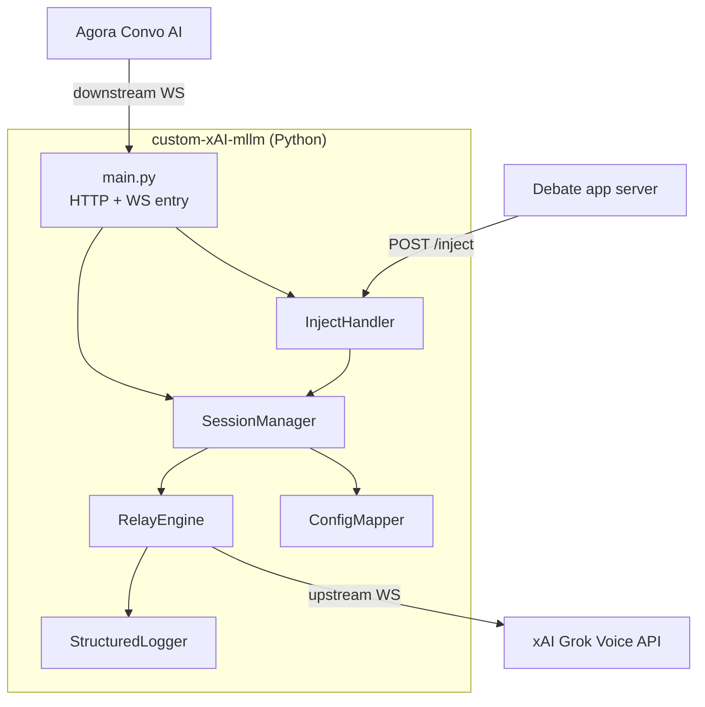
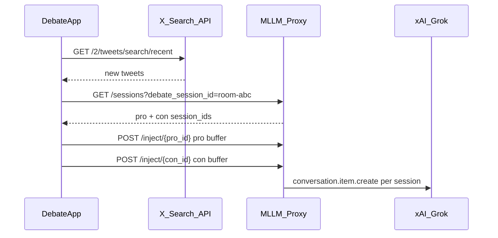

# spec.prd — Custom xAI MLLM Proxy (v1 Implementation Spec)

**Parent doc:** [prd.md](./prd.md)  
**References:** [xAI Voice Agent API](https://docs.x.ai/developers/model-capabilities/audio/voice-agent), [Agora xAI MLLM](https://docs.agora.io/en/conversational-ai/models/mllm/xai)

---

## 1. Purpose

Turn `prd.md` into an **implementation-ready engineering spec** for v1: a Python WebSocket proxy between Agora Conversational AI and xAI Grok Voice Agent API.

**v1 delivers:** transparent bidirectional relay + HTTP health/inject skeleton + structured logs.  
**v1 does not deliver:** live X injection logic, MCP tools, debate app changes.

---

## 2. Default decisions (resolves open PRD questions)

Until overridden, implement with these defaults:

| Open question | Default for v1 |
|---------------|----------------|
| Session ID source | **Proxy generates UUID** on downstream connect; log it; expose via `GET /sessions` for debate app discovery |
| Local dev tunnel | **ngrok** (`ngrok http 8080`) — simpler for WebSocket |
| Inject stub behavior | **Wire real `conversation.item.create`** when upstream is connected; honor `trigger_response: false` (no `response.create`). Return `404` if session missing, `409` if upstream not ready |

---

## 3. System components



### Module responsibilities

| Module | File | Responsibility |
|--------|------|----------------|
| Entry | `src/main.py` | Start HTTP + WS server; route handlers |
| Sessions | `src/session.py` | Registry, lifecycle, UUID assignment |
| Relay | `src/relay.py` | Bidirectional JSON relay; reconnect upstream |
| Config | `src/config_mapper.py` | Agora REST config → xAI `session.update` (if needed on WS) |
| Inject | `src/inject.py` | HTTP side-channel → upstream `conversation.item.create` |
| Config env | `src/settings.py` | Pydantic settings from env |
| Logging | `src/logging.py` | structlog JSON formatter |

---

## 4. Connection lifecycle

### 4.1 Downstream connect (Agora → Proxy)

```
Agora opens: wss://<proxy>/realtime?model=grok-voice-latest
Optional scope: ?debate_session_id=<appRoomId>&side=pro|con
Optional auth: Authorization: Bearer <PROXY_AUTH_TOKEN>
```

**Session scoping (multi-agent / multi-meeting):**

| Query param | Set by | Purpose |
|-------------|--------|---------|
| `debate_session_id` | Debate app (existing room/session ID) | Isolate inject targets per debate room |
| `side` | Debate app (`pro` or `con`) | Which agent role |

Example URLs:

```
wss://<proxy>/realtime?debate_session_id=room-abc-123&side=pro
wss://<proxy>/realtime?debate_session_id=room-abc-123&side=con
```

Proxy generates its own `session_id` (UUID) per connection — **do not** pass proxy `session_id` in the WebSocket URL. Use `GET /sessions` to map `(debate_session_id, side)` → proxy `session_id` for inject.

**Uniqueness:** reject WS connect with code `1008` if `(debate_session_id, side)` is already active.

**Steps:**

1. Validate `PROXY_AUTH_TOKEN` if set (compare downstream `Authorization` header).
2. Parse and validate `debate_session_id` + `side` (both optional together; if one is set, both required).
3. Reject duplicate `(debate_session_id, side)` if already active.
4. Generate `session_id = uuid4()`.
5. Register session in `SessionManager` with scope fields.
6. Open upstream: `wss://api.x.ai/v1/realtime?model={XAI_MODEL}` with `Authorization: Bearer {XAI_API_KEY}`.
7. Start two asyncio tasks: `relay_downstream_to_upstream`, `relay_upstream_to_downstream`.
8. Log `session.created` with `session_id`, `debate_session_id`, `side`.

### 4.2 Upstream connect (Proxy → xAI)

Per [xAI Voice Agent API](https://docs.x.ai/developers/model-capabilities/audio/voice-agent):

```python
UPSTREAM_URL = f"wss://api.x.ai/v1/realtime?model={settings.xai_model}"
HEADERS = {"Authorization": f"Bearer {settings.xai_api_key}"}
```

**On upstream `session.created`:** proxy does **not** auto-send `session.update` in v1 pass-through mode unless Agora does not send it. First milestone: pure relay; second milestone: inject mapped config if Agora omits fields.

### 4.3 Disconnect

- Either side closes → cancel relay tasks → remove session from registry → log `session.closed`.
- Upstream error → close downstream with appropriate code → log `session.error`.

---

## 5. WebSocket event protocol

### 5.1 Relay rules (v1)

| Rule | Behavior |
|------|----------|
| Direction | Downstream → upstream: relay verbatim JSON string |
| Direction | Upstream → downstream: relay verbatim JSON string |
| Binary | Not expected in v1; log warning if received |
| Parse | Parse JSON only for logging (type, session_id); do not mutate payload in v1 |
| Ordering | Preserve message order per direction |

### 5.2 xAI events to expect (reference)

**Client → Server (Agora sends these through proxy):**

| Event | Purpose |
|-------|---------|
| `session.update` | Voice, instructions, turn_detection, audio format |
| `input_audio_buffer.append` | Stream user audio (base64 PCM) |
| `input_audio_buffer.commit` | Manual turn end (if not server_vad) |
| `conversation.item.create` | Text user messages |
| `response.create` | Trigger model response |
| `response.cancel` | Cancel in-flight response |

**Server → Client (xAI returns through proxy):**

| Event | Purpose |
|-------|---------|
| `session.created` / `session.updated` | Session ack |
| `input_audio_buffer.speech_started` / `speech_stopped` | VAD events |
| `conversation.item.input_audio_transcription.updated` | Transcript (xAI naming) |
| `response.created` | Response started |
| `response.output_audio.delta` | Audio chunks (base64 PCM) |
| `response.output_text.delta` | Text chunks |
| `response.done` | Turn complete |
| `error` | Failure |

**xAI-specific (not in OpenAI):**

| Event | Notes |
|-------|-------|
| `force_message` via `conversation.item.create` | TTS scripted line; no `response.create` |
| Per-response `instructions` on `response.create` | v2 dynamic context |

### 5.3 Agora → xAI config mapping (when proxy must synthesize `session.update`)

If Agora config arrives only via REST (not over WS), debate app is responsible today. If Agora sends `session.update` over WS, relay as-is.

**Fallback mapper** (`config_mapper.py`) for manual testing:

```python
def agora_mllm_to_session_update(mllm: dict) -> dict:
    params = mllm.get("params") or {}
    td = mllm.get("turn_detection") or {}
    vad = td.get("server_vad_config") or {}

    instructions = "\n".join(
        m["content"] for m in mllm.get("messages") or [] if m.get("content")
    )

    return {
        "type": "session.update",
        "session": {
            "instructions": instructions,
            "voice": params.get("voice", "eve"),
            "turn_detection": {
                "type": "server_vad",
                "threshold": vad.get("threshold", 0.5),
                "prefix_padding_ms": vad.get("prefix_padding_ms", 640),
                "silence_duration_ms": vad.get("silence_duration_ms", 900),
            },
            "audio": {
                "input": {
                    "format": {
                        "type": "audio/pcm",
                        "rate": params.get("sample_rate", 24000),
                    }
                },
                "output": {
                    "format": {
                        "type": "audio/pcm",
                        "rate": params.get("sample_rate", 24000),
                    }
                },
            },
        },
    }
```

**Language hint** (if `params.language` set):

```python
session["audio"]["input"]["transcription"] = {
    "language_hint": params["language"]  # e.g. "en"
}
```

---

## 6. HTTP API spec

### 6.1 `GET /health`

```json
{ "status": "ok", "version": "0.1.0", "active_sessions": 2 }
```

### 6.2 `GET /sessions`

List active sessions (for debate app discovery). Optional filter:

```
GET /sessions?debate_session_id=room-abc-123
```

```json
{
  "sessions": [
    {
      "session_id": "proxy-uuid-1",
      "debate_session_id": "room-abc-123",
      "side": "pro",
      "created_at": "2026-06-05T12:00:00Z",
      "upstream_connected": true,
      "model": "grok-voice-latest"
    },
    {
      "session_id": "proxy-uuid-2",
      "debate_session_id": "room-abc-123",
      "side": "con",
      "created_at": "2026-06-05T12:00:00Z",
      "upstream_connected": true,
      "model": "grok-voice-latest"
    }
  ]
}
```

| Field | Owner | Used for |
|-------|-------|----------|
| `session_id` | Proxy (UUID) | `POST /inject/{session_id}` |
| `debate_session_id` | Debate app | Filter sessions per room |
| `side` | Debate app | `pro` or `con` agent targeting |

### 6.3 `POST /inject/{session_id}` — live context injection

HTTP side-channel for pushing live X/tweet context into an agent session **without** going through the Agora voice WebSocket.

**Who calls it:** Debate app (Next.js server) after polling/sanitizing tweets from the X Search API.

**Targeting flow:**

1. Debate app knows its `debate_session_id` (same ID passed in Agora `mllm.url`).
2. `GET /sessions?debate_session_id=<id>` → find `side=pro` and `side=con` proxy `session_id`s.
3. `POST /inject/{session_id}` with pro buffer → pro agent; con buffer → con agent.



**Request:**

```json
{
  "text": "[LIVE X - PRO] @user123: Tweet content here...",
  "role": "user",
  "trigger_response": false
}
```

| Field | Default | Notes |
|-------|---------|-------|
| `text` | required | Sanitized tweet or rolling summary from debate app |
| `role` | `"user"` | Injected as user-context message |
| `trigger_response` | `false` | `false` = silent inject (no interrupt); `true` = also send `response.create` |

**Behavior:**

1. Lookup session; `404` if not found.
2. If upstream WS not open; `409`.
3. Send upstream:

```json
{
  "type": "conversation.item.create",
  "item": {
    "type": "message",
    "role": "user",
    "content": [{ "type": "input_text", "text": "<text>" }]
  }
}
```

4. If `trigger_response: true`, also send `{"type": "response.create"}`.
5. Log `inject.sent` with `session_id`, `debate_session_id`, `side`, `text_length`.
6. Return `200`:

```json
{
  "session_id": "proxy-uuid-1",
  "debate_session_id": "room-abc-123",
  "side": "pro",
  "injected": true,
  "trigger_response": false
}
```

**Cross-send prevention:**

- Debate app filters by its own `debate_session_id` and matches `side` before inject.
- Proxy rejects duplicate `(debate_session_id, side)` WebSocket connects while active.

**Auth (v1):** optional `Authorization: Bearer <PROXY_AUTH_TOKEN>` on HTTP routes.

---

## 7. Authentication

| Hop | Mechanism |
|-----|-----------|
| Agora → Proxy (WS) | Optional `PROXY_AUTH_TOKEN` in `Authorization: Bearer` on upgrade |
| Proxy → xAI (WS) | `XAI_API_KEY` from env only — **never** forward Agora `mllm.api_key` to xAI |
| Debate app → Proxy (HTTP) | Same `PROXY_AUTH_TOKEN` if set |

---

## 8. Logging spec

Use **structlog** JSON. Every WS message:

```json
{
  "event": "ws.message",
  "session_id": "uuid",
  "direction": "downstream_to_upstream | upstream_to_downstream",
  "type": "input_audio_buffer.append",
  "timestamp": "ISO8601",
  "payload_size_bytes": 1234,
  "payload": { "...": "..." }
}
```

**Redaction rules:**

- Replace base64 audio in `input_audio_buffer.append` and `response.output_audio.delta` with `"<redacted:N bytes>"` unless `LOG_AUDIO=1`.
- Never log `XAI_API_KEY` or `PROXY_AUTH_TOKEN`.

**Session lifecycle events:** `session.created`, `session.upstream_connected`, `session.closed`, `session.error`, `inject.sent`.

---

## 9. Implementation milestones

### Milestone 0 — Scaffold (Day 1)

- [ ] Python project layout per `prd.md`
- [ ] `settings.py`, `requirements.txt`, `Dockerfile`, `railway.toml`
- [ ] `GET /health` works

### Milestone 1 — Upstream-only smoke test (Day 1–2)

Standalone script `scripts/smoke_xai.py`:

- Connect to xAI directly
- Send `session.update` (voice `eve`, server_vad)
- Send text `conversation.item.create` + `response.create`
- Log all server events

**Pass:** receive `response.output_audio.delta` and `response.done`.

### Milestone 2 — Transparent proxy (Day 2–3)

- [ ] Downstream WS `/realtime` accepts connections
- [ ] Upstream pair per session
- [ ] Bidirectional verbatim relay
- [ ] Structured logs with redaction

**Pass:** xAI tester app or `smoke_xai` through proxy (not Agora yet).

### Milestone 3 — Agora integration (Day 3–4)

- [ ] ngrok tunnel to localhost
- [ ] Debate app `mllm.url` → `wss://<ngrok>/realtime`
- [ ] Single agent: human speaks, agent responds

**Pass:** all v1 acceptance criteria except Railway.

### Milestone 4 — Inject + deploy (Day 4–5)

- [x] `POST /inject/{session_id}` wired
- [x] `GET /sessions` with `debate_session_id` + `side` scoping
- [x] `GET /sessions?debate_session_id=` filter
- [ ] Railway deploy with `wss://`
- [ ] Manual inject test while agent is speaking (no interrupt)

**Pass:** full v1 acceptance criteria.

---

## 10. File layout (exact)

```
custom-xAI-mllm/
├── spec.prd
├── prd.md
├── debate-architcture.md
├── requirements.txt
├── Dockerfile
├── railway.toml
├── .env.example
├── README.md
├── scripts/
│   └── smoke_xai.py
├── src/
│   ├── __init__.py
│   ├── main.py
│   ├── settings.py
│   ├── logging.py
│   ├── session.py
│   ├── relay.py
│   ├── config_mapper.py
│   └── inject.py
└── tests/
    ├── test_config_mapper.py
    ├── test_inject.py
    └── test_inject_route.py
```

---

## 11. Dependencies

```txt
# requirements.txt
websockets>=13.0
starlette>=0.38.0
uvicorn[standard]>=0.30.0
structlog>=24.0.0
pydantic-settings>=2.0.0
python-dotenv>=1.0.0
```

**Why Starlette + uvicorn:** HTTP (`/health`, `/inject`, `/sessions`) and WebSocket on one process.

---

## 12. Environment

```env
# .env.example
XAI_API_KEY=xai-...
XAI_MODEL=grok-voice-latest
PROXY_AUTH_TOKEN=optional-shared-secret
PORT=8080
LOG_LEVEL=info
LOG_AUDIO=0
HOST=0.0.0.0
```

---

## 13. Core interfaces (Python)

```python
# src/session.py
@dataclass
class ProxySession:
    session_id: str
    downstream_ws: WebSocket
    upstream_ws: WebSocket | None
    created_at: datetime
    model: str

class SessionManager:
    async def create(self, downstream_ws: WebSocket, model: str) -> ProxySession: ...
    async def connect_upstream(self, session: ProxySession) -> None: ...
    def get(self, session_id: str) -> ProxySession | None: ...
    async def close(self, session_id: str, reason: str) -> None: ...
    def list_active(self) -> list[ProxySession]: ...
```

```python
# src/relay.py
async def relay_loop(session: ProxySession, log) -> None:
    """Run downstream→upstream and upstream→downstream concurrently."""
```

```python
# src/inject.py
async def inject_text(
    session: ProxySession,
    text: str,
    role: str = "user",
    trigger_response: bool = False,
) -> None: ...
```

---

## 14. Error handling

| Scenario | Action |
|----------|--------|
| Upstream connect fails | Close downstream with 1011; log error |
| Upstream drops mid-session | Close downstream; log `session.error` |
| Downstream drops | Close upstream; cleanup session |
| Malformed JSON | Log warning; forward raw string (v1) or drop (v2) |
| Inject to dead session | HTTP 404 |
| Inject before upstream ready | HTTP 409 |

---

## 15. Testing plan

| Test | Type | How |
|------|------|-----|
| Config mapper | Unit | `test_config_mapper.py` with sample Agora `mllm` JSON |
| Inject payload | Unit | Assert no `response.create` when `trigger_response=false` |
| xAI direct | Script | `scripts/smoke_xai.py` |
| Proxy relay | Integration | Point smoke script at `ws://localhost:8080/realtime` |
| Agora E2E | Manual | Debate app + ngrok + voice conversation |
| Inject E2E | Manual | `curl POST /inject/...` while agent speaking; verify no interrupt |

---

## 16. Railway deployment

```toml
# railway.toml
[build]
builder = "dockerfile"

[deploy]
healthcheckPath = "/health"
healthcheckTimeout = 30
restartPolicyType = "on_failure"
```

- Expose `PORT` from Railway env.
- Use `wss://<service>.up.railway.app/realtime` in Agora.
- Set `XAI_API_KEY` and `PROXY_AUTH_TOKEN` in Railway secrets.

---

## 17. v2 hooks (build now, implement later)

Leave extension points in v1 code:

| Hook | Location | v2 use |
|------|----------|--------|
| `on_upstream_event(type, payload)` | `relay.py` | Queue inject until `response.done` |
| `session.metadata` | `session.py` | Store `agent_role` (PRO/CON) from query param |
| `config_mapper` tools | `config_mapper.py` | Add `x_search`, `mcp` to `session.update.tools` |
| Inject queue | `inject.py` | Buffer if `response.in_progress` |

---

## 18. Acceptance checklist (from prd.md)

- [ ] `ws://localhost:8080/realtime` relay works
- [ ] Agora single-agent voice conversation via ngrok
- [ ] `mllm.params.voice` pass-through verified in logs
- [ ] `greeting_message` plays (Agora-side)
- [ ] Structured logs with direction + type + session_id
- [ ] `POST /inject/{session_id}` returns 200
- [ ] `GET /health` + `GET /sessions`
- [ ] Railway `wss://` works with Agora

---

## 19. Assumptions carried into spec

Same 18 assumptions from `prd.md` §Assumptions, plus:

| # | Spec assumption |
|---|-----------------|
| 19 | Use **Starlette + uvicorn** (not raw websockets server alone) for combined HTTP/WS |
| 20 | **Proxy generates session_id** unless later overridden |
| 21 | v1 inject is **fully wired** (not stub) per default decision above |
| 22 | Agora sends `session.update` over WS after connect — if not, enable fallback mapper in Milestone 3 |

---

## 20. Resolved questions (from prd.md)

| Question | Answer |
|----------|--------|
| v1 success criterion | **A** — Single agent, human talks, agent responds |
| v1 scope | **Proxy service only** (this repo) |
| Debate app location | **Other repo**; hosts MLLM from this repo, passes URL |
| Agora vendor | Keep **`vendor: "xai"`** |
| WebSocket protocol | **OpenAI Realtime-style** events |
| Language | **Python** |
| Deployment | **Localhost first**, then **Railway** |
| Turn detection | **`server_vad`** |
| API key | **Server-side in proxy** |
| Context injection (v2) | **Option A** — `conversation.item.create`, no `response.create` |
